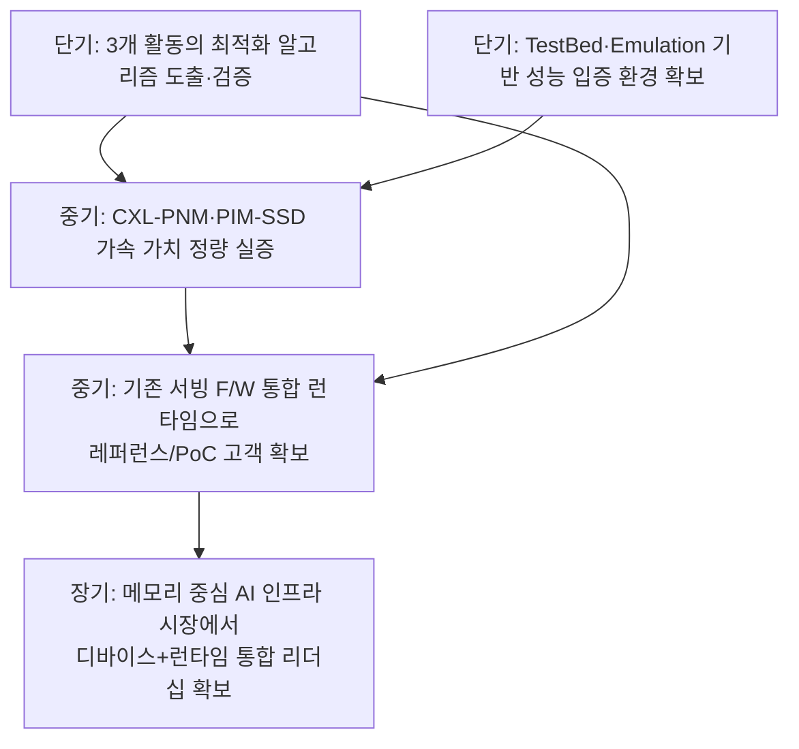
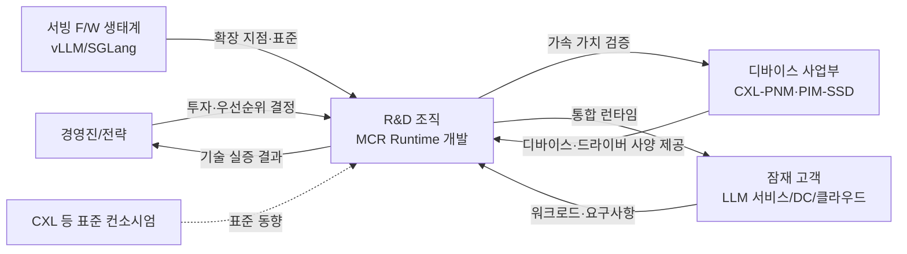

# 비즈니스 요구사항

## 비즈니스 개요

### 비즈니스 배경

LLM 서비스 규모가 급격히 확대되면서 추론(serving) 단계의 GPU 자원 비용과 메모리 병목이 사업성의 핵심 제약으로 부상하고 있다. 동시에 PIM/PNM, CXL 확장 메모리, PIM-SSD 등 **메모리 중심(Memory-Centric) 컴퓨팅** 하드웨어가 등장하면서, 연산을 데이터가 위치한 메모리 계층으로 이동시켜 GPU 부하와 데이터 이동 비용을 줄이는 새로운 최적화 기회가 열리고 있다.

본 과제(`MCR Runtime`)는 이러한 이기종 메모리 계층 위에서 LLM 추론을 비용 인지(cost-aware) 방식으로 최적화하는 런타임 기술을 확보하기 위한 **연구 과제**이다. 자사는 메모리/Computable-Memory 디바이스를 보유·개발하는 주체로서, 디바이스의 가치를 실증하고 소프트웨어 스택까지 아우르는 기술 경쟁력을 확보하고자 한다.

### 비즈니스 목적

- 메모리 중심 시스템에서 LLM 추론의 **단위 비용(처리량 대비 GPU·메모리 비용)을 절감**하는 핵심 런타임 기술 확보
- 자사 Computable-Memory 디바이스(CXL-PNM, PIM-SSD)의 **기술적 가치를 실증**하여 제품 경쟁력 제고
- 기존 LLM 서빙 생태계(vLLM/SGLang 등)와 통합 가능한 형태로 기술을 확보하여 **시장 채택 가능성** 확보

### 비즈니스 가치 제안

- **추론 비용 절감**: GPU 연산 최소화 + KV 캐시 최적화 + Computable-Memory 오프로딩으로 동일 처리량을 더 낮은 비용으로 제공
- **하드웨어 차별화 실증**: 자사 디바이스를 SW 런타임과 결합해 "디바이스+런타임"의 통합 가치를 제시
- **생태계 적합성**: 표준 서빙 프레임워크와 통합되어 도입 장벽이 낮은 기반 기술 제공

## 비즈니스 목표

### 단기 목표 (~1년, 알고리즘 확보·검증)

- Cost-aware Memory-centric Inference Scheduling 알고리즘 도출 및 검증
- Non-contiguous KV 캐시 재사용 및 KV 캐시 압축 알고리즘 확보
- Tiered Memory KV Cache Classification/Migration 알고리즘으로 TTFT 개선 입증
- CXL-PNM(Attention 오프로딩)·PIM-SSD(Retrieving 가속) 가속 알고리즘 도출
- MCR TestBed 및 QEMU 에뮬레이션 기반 성능 평가 환경 확보

### 중기 목표 (~2-3년, 통합·실증)

- 기존 LLM 서빙 프레임워크와 통합된 런타임 형태로 통합도 검증
- Computable-Memory 디바이스의 가속 가치(비용·처리량·TTFT)를 정량적으로 실증
- 내부/파트너 대상 PoC 및 레퍼런스 워크로드 확보

### 장기 목표 (3년+, 시장 리더십)

- 메모리 중심 AI 인프라 시장에서 "디바이스 + 런타임" 통합 솔루션 리더십 확보
- 자사 차세대 메모리/Computable-Memory 제품 로드맵과 결합한 기술 표준화 영향력 확보

### 목표 우선순위

1. **단기 알고리즘 확보·검증이 최우선** — 이후 모든 실증·통합의 기반이며, 과제 성패를 좌우한다.
2. 중기 실증(정량 효과 입증)은 단기 산출물에 의존한다.
3. 장기 시장 리더십은 단기·중기 성과의 누적 결과이며, 직접 설계 대상이 아니라 방향성으로 둔다.

## 비즈니스 드라이버

### 시장 요구사항

- LLM 추론 비용(특히 GPU·HBM)의 급증에 따른 **TCO 절감** 요구
- 긴 컨텍스트·RAG 워크로드 확대에 따른 **대용량 KV 캐시/검색 처리** 요구
- 응답 지연(특히 TTFT) 단축에 대한 서비스 품질 요구

### 경쟁력 요인

- GPU 중심 스택 대비 **메모리 중심 오프로딩**이라는 차별적 접근
- 자사가 보유·개발하는 CXL-PNM·PIM-SSD 디바이스와의 **수직 결합** 가능
- 표준 서빙 프레임워크와의 **통합성**으로 낮은 도입 장벽

### 수익성 목표

- 직접 매출보다 **자사 메모리/Computable-Memory 제품 채택 확대**를 통한 간접 수익 기여
- 추론 단위 비용 절감을 통해 자사 디바이스의 **가격 대비 가치(value proposition)** 강화
- (연구 과제 단계이므로 단기 직접 수익보다 기반 기술 자산화·IP 확보가 우선)

### 성장 전략

- 알고리즘 → 실증 → 생태계 통합의 단계적 확장 (System Modeling → 실제 시스템 → Emulation)
- 디바이스 로드맵(차세대 CXL-PNM, PIM-SSD)과 런타임 기술을 동반 발전시키는 수직 통합 전략

## 이해관계자

### 주요 이해관계자

- **경영진/전략 부서**
  - 역할: 과제 투자·우선순위·자원 배분 결정
  - 관심사: 기술 경쟁력 확보, 디바이스 사업 기여도, ROI/리스크
  - 영향력: 높음
- **R&D 조직 (MCR Runtime 개발팀)**
  - 역할: 런타임·알고리즘 설계 및 검증 수행 (본 시스템의 주 개발 주체)
  - 관심사: 알고리즘 성능, 통합 용이성, 검증 환경 확보
  - 영향력: 높음
- **디바이스 사업부 (CXL-PNM·PIM-SSD)**
  - 역할: Computable-Memory 디바이스/드라이버 사양 제공, 가속 가치 실증의 수혜자
  - 관심사: 디바이스 채택 확대, 가속 가치의 정량적 입증
  - 영향력: 높음
- **잠재 고객 (LLM 서비스 운영사/데이터센터/클라우드)**
  - 역할: 기술 도입 후보, 워크로드·요구사항 제공
  - 관심사: 추론 TCO 절감, TTFT/처리량, 기존 스택과의 호환성
  - 영향력: 중간
- **LLM 서빙 프레임워크 생태계 (vLLM/SGLang 등)**
  - 역할: 통합 대상 플랫폼 및 확장 지점 제공
  - 관심사: 호환성, 확장 API 안정성
  - 영향력: 중간
- **표준 컨소시엄 (CXL 등)**
  - 역할: 인터페이스/표준 동향 제공
  - 관심사: 표준 정합성
  - 영향력: 낮음

### 이해관계자 관계

경영진은 R&D에 투자·우선순위를 부여하고, R&D는 디바이스 사업부와 긴밀히 협력하여 디바이스 가속 가치를 실증한다(상호 의존이 가장 강함). R&D는 서빙 F/W 생태계의 확장 지점 위에서 런타임을 구현하고, 그 산출물을 잠재 고객 워크로드로 검증한다. 표준 컨소시엄은 외부 제약/방향성으로 작용한다.

## 성공 지표

> 아래 지표는 **비즈니스 성공 지표(KPI)**이며, 측정 가능한 품질 허용치(NFR)와 우선순위 기반 품질 속성(QA)의 상세 정의는 Phase 4(품질 요구사항 선정)에서 구체화한다.

### 핵심 성과 지표 (KPI)

- **추론 단위 비용 절감률**
  - 측정 방법: 동일 워크로드·처리량 기준 GPU·메모리 비용 비교(Baseline 대비)
  - 목표 값: Baseline(GPU 중심) 대비 유의미한 절감 (구체 목표는 Phase 4에서 NFR로 정의)
  - 측정 주기: 마일스톤별
- **End-to-End 추론 처리량 향상률**
  - 측정 방법: 동일 자원 기준 throughput(tokens/s) 비교
  - 목표 값: Baseline 대비 향상
  - 측정 주기: 마일스톤별
- **TTFT(Time To First Token) 개선률**
  - 측정 방법: Tiered Memory KV Cache 배치 적용 전후 TTFT 비교
  - 목표 값: Baseline 대비 단축
  - 측정 주기: 마일스톤별
- **GPU 연산 오프로딩 비율 / KV 캐시 재사용률**
  - 측정 방법: CXL-PNM·PIM-SSD 오프로딩 비중, Non-contiguous 재사용 적중률 측정
  - 목표 값: 알고리즘 검증 기준 충족
  - 측정 주기: 실험 회차별
- **가속 알고리즘 검증 완료 수 (활동별)**
  - 측정 방법: 3개 활동(Inference Orchestration / Computable-Memory / Tiered-Memory)별 도출·검증된 알고리즘 수
  - 목표 값: 활동별 핵심 알고리즘 검증 완료
  - 측정 주기: 단계(System Modeling→실제 시스템→Emulation)별
- **디바이스 가속 가치 실증 (사업 기여)**
  - 측정 방법: CXL-PNM·PIM-SSD 적용 시 비용/성능 이득의 정량 리포트, PoC/레퍼런스 확보 수
  - 목표 값: 중기 내 정량 실증 및 레퍼런스 확보
  - 측정 주기: 분기/마일스톤별

---

> **참고**: 본 문서는 Phase 1 business-analyzer가 `system.md`를 기반으로 작성한 비즈니스 분석서이다. 시스템 범위(런타임 계층 중심 + 기존 서빙 F/W 통합, 3개 핵심 활동)와 비즈니스 목표의 일관성을 확인하였다. 본 KPI와 드라이버는 Phase 4(품질 요구사항 선정)의 NFR/QA 도출에 주요 입력으로 사용된다. 기능 상세 명세는 `usecase-extractor`(`/agentk/extract-usecases`)가 담당한다.
