# 설계 포인트 (Design Points)

## 개요

### 목적

확정된 품질 요구사항(`qualities.md`의 NFR/QA), 품질 시나리오(`quality/QS-nnn.md`), 도메인 모델(`domain/model.md`), 핵심 ASR Use Case(`usecases.md`), 시스템 제약(`system.md`)을 교차 분석하여, MCR Runtime에서 **구조적 선택이 강제되는 설계 결정 지점(Design Point)**을 도출한다. 각 설계 포인트는 "결정해야 할 질문"이며, 답(전술/패턴 선택)은 Phase 5(후보 구조 설계)에서 내려진다.

### 도출 기준
1. **Trade-off**: 품질 속성 간 긴장이 발생하는 곳
2. **Impact**: 여러 컴포넌트 구조에 파급되는 결정
3. **Irreversible**: 되돌리기 어려운, 일찍 못 박아야 하는 결정
4. **Risk**: 검증되지 않은 기술·불확실성이 높은 곳

### 입력 산출물
`qualities.md` (NFR-001~004, QA-001~012) / `quality/QS-001~020.md` / `domain/model.md` (Boundary 6·Control 14·Entity 5) / `usecases.md` (핵심 ASR 8건) / `system.md` (제약)

## 설계 포인트 요약 (추적 매트릭스)

| ID | 제목 | 도출 기준 | 관련 NFR/QA | 관련 QS | 관련 UC | 영향 컴포넌트 | 분류 |
|----|------|----------|-------------|---------|---------|--------------|------|
| DP-001 | 추론 스케줄링/배치 결정의 정교함 ↔ 온라인 오버헤드 | Trade-off, Impact | NFR-002, QA-001, QA-002, QA-006 | QS-001, QS-002, QS-007 | UC-001, UC-004 | InferenceScheduler, KVCachePlacementPlanner, SystemStateStore, CostModelStore | Trade-off / Sensitivity |
| DP-002 | 성능 Cost 모델의 추상화·정확도·교정 방식 | Impact, Irreversible, Trade-off | NFR-001, QA-001~003, QA-010, QA-011 | QS-004, QS-007, QS-013, QS-018 | UC-010, UC-001, UC-008 | CostModelStore, CostModelManager, 결정 Control 전반, MonitoringInterface | Sensitivity |
| DP-003 | 이기종 메모리/가속기 추상화 경계 | Impact, Irreversible, Trade-off | QA-010, QA-012, QA-003~005 | QS-012, QS-015 | UC-004, UC-006, UC-007 | MemoryTierInterface, CXLPNMInterface, PIMSSDInterface, CostModelStore | Trade-off |
| DP-004 | Non-contiguous KV 재사용 인덱싱·매칭과 무결성 보장 | Risk, Trade-off | NFR-003, QA-007 | QS-005, QS-019 | UC-002 | KVCacheReuseResolver, KVCacheRegistry | Risk / Trade-off |
| DP-005 | 연산/검색 오프로딩 분배와 GPU↔디바이스 데이터 흐름 | Risk, Impact, Trade-off | NFR-004, QA-003, QA-004, QA-005 | QS-003, QS-008, QS-009, QS-020 | UC-006, UC-007, UC-008 | ComputeDispatchPlanner, ComputeOffloadExecutor, RetrievalOffloadExecutor, CXLPNMInterface, PIMSSDInterface | Risk / Trade-off |
| DP-006 | KV 캐시 압축 적용 범위와 압축↔복원 비용 균형 | Trade-off, Impact | QA-008, QA-002, QA-006, QA-007 | QS-006, QS-005 | UC-003 | KVCacheCompressor, KVCacheRegistry, KVCacheReuseResolver | Trade-off |
| DP-007 | KV 분류/마이그레이션 시점과 추론 경로 격리 | Trade-off, Impact | QA-001, QA-002, QA-006 | QS-010, QS-007 | UC-005 | KVCacheClassifier, KVCacheMigrator, MemoryTierInterface, KVCacheRegistry | Trade-off |
| DP-008 | 서빙 프레임워크 통합 경계(확장 지점 의존 범위) | Irreversible, Trade-off, Impact | QA-009 | QS-017, QS-014 | UC-001, UC-009 | ServingGatewayAPI, InferenceScheduler | Trade-off |
| DP-009 | TestBed↔Emulation 일관성 확보 구조 | Risk, Impact | QA-011, NFR-001 | QS-018, QS-013 | UC-010, UC-012 | CostModelStore, CostModelManager, MonitoringInterface, MetricsStore | Risk / Sensitivity |

## 설계 포인트 도출 과정 (마인드맵)

```mermaid
graph TD
    subgraph 긴장원
      OVH[NFR-002 / QS-007<br/>의사결정 오버헤드 제약]
      COST[QA-001 / NFR-001<br/>비용 효율]
      LAT[QA-006 / QS-001<br/>TTFT]
      THRU[QA-002<br/>처리량]
      DEV[QA-003~005<br/>디바이스 가속·GPU절감]
      REUSE[QA-007 + NFR-003<br/>재사용 적중률 ↔ 정확성]
      MEM[QA-008<br/>메모리 절감]
      MOD[QA-010 / QA-012<br/>변경 용이성·확장성]
      INTEG[QA-009<br/>서빙 통합성]
      ENV[QA-011 / QS-018<br/>검증 환경 일관성]
    end

    OVH --> DP1[DP-001 스케줄링 정교함↔오버헤드]
    COST --> DP1
    LAT --> DP1
    COST --> DP2[DP-002 Cost 모델 추상화·정확도]
    DEV --> DP2
    MOD --> DP2
    ENV --> DP2
    MOD --> DP3[DP-003 메모리/가속기 추상화 경계]
    DEV --> DP3
    REUSE --> DP4[DP-004 재사용 인덱싱·무결성]
    DEV --> DP5[DP-005 오프로딩 분배·데이터 흐름]
    THRU --> DP5
    MEM --> DP6[DP-006 압축 범위·비용 균형]
    THRU --> DP6
    LAT --> DP7[DP-007 분류/마이그레이션 시점·격리]
    INTEG --> DP8[DP-008 서빙 통합 경계]
    ENV --> DP9[DP-009 TestBed↔Emulation 일관성]
```

## 설계 포인트 상세

### DP-001-추론-스케줄링-배치-결정의-정교함-대-온라인-오버헤드
- **쟁점(Tension)**: 비용·TTFT 최적화를 위해 배치/스케줄 결정을 정교하게 할수록 온라인 의사결정 오버헤드가 커져 추론 경로 지연을 유발한다. 정교함과 경량성이 정면 충돌한다.
- **도출 기준**: Trade-off(성능 최적성 ↔ 오버헤드), Impact(스케줄러·배치·상태·Cost 모델 전반)
- **관련 품질 요구사항**: NFR-002, QA-001, QA-002, QA-006
- **관련 품질 시나리오**: QS-001(TTFT), QS-002(처리량), QS-007(의사결정 오버헤드)
- **관련 핵심 기능 Use Case**: UC-001, UC-004
- **영향 받는 컴포넌트**: InferenceScheduler, KVCachePlacementPlanner, SystemStateStore, CostModelStore
- **결정해야 할 질문**: 배치/스케줄 결정을 어느 수준의 정교함으로 수행할 것인가? 매 요청 온라인 최적화인가, 사전계산/근사 휴리스틱과의 조합인가, 결정 빈도/입도를 어떻게 둘 것인가?
- **검토 방향(개략, 미결정)**: 경량 휴리스틱, 사전계산된 정책 테이블, 비동기/주기적 재계산, 결정 캐시 등 — 구체 선택과 트레이드오프는 Phase 5에서 평가.
- **분류**: Trade-off Point + Sensitivity Point
- **비고**: NFR-002의 "오버헤드가 이득을 상쇄하지 않음" 제약이 이 지점의 경계 조건이다.

### DP-002-성능-Cost-모델의-추상화-정확도-교정-방식
- **쟁점(Tension)**: Cost 모델의 정확도가 모든 결정(스케줄링·배치·분배) 품질을 좌우하지만, 정확도를 높이면 평가 오버헤드가 커지고, 범용성(신규 디바이스 수용)·환경 일관성(실측↔에뮬)과도 긴장한다.
- **도출 기준**: Impact(모든 결정 로직이 의존), Irreversible(모델 추상화가 결정 로직 전반에 박힘), Trade-off
- **관련 품질 요구사항**: NFR-001, QA-001~003, QA-010, QA-011
- **관련 품질 시나리오**: QS-004, QS-007, QS-013, QS-018
- **관련 핵심 기능 Use Case**: UC-010, UC-001, UC-008
- **영향 받는 컴포넌트**: CostModelStore, CostModelManager, InferenceScheduler/KVCachePlacementPlanner/ComputeDispatchPlanner, MonitoringInterface
- **결정해야 할 질문**: Cost 모델을 어떤 추상화(파라메트릭 모델 vs 측정 기반 룩업 vs 학습 모델)로 표현하고, 결정 로직과 어떻게 분리하며, 실측↔에뮬레이션 교정을 어떻게 반영할 것인가?
- **검토 방향(개략, 미결정)**: 디바이스/계층 비용 특성의 플러그형 추상화, 교정 데이터 주입 인터페이스, 모델-결정 분리 등.
- **분류**: Sensitivity Point (정확도가 전체 결정 품질을 좌우)
- **비고**: DP-009(환경 일관성)와 교정 측면에서 연결됨.

### DP-003-이기종-메모리-가속기-추상화-경계
- **쟁점(Tension)**: 이기종 메모리/디바이스를 공통 인터페이스로 추상화하면 변경 용이성·확장성이 좋아지지만, 디바이스 고유 가속 기능을 충분히 노출하지 못하면 성능 이득이 줄어든다.
- **도출 기준**: Impact(여러 인터페이스/결정 컴포넌트), Irreversible(추상화 경계는 후에 바꾸기 어려움), Trade-off(추상화 일반성 ↔ 디바이스 고유 성능)
- **관련 품질 요구사항**: QA-010, QA-012, QA-003~005
- **관련 품질 시나리오**: QS-012(신규 디바이스 추가), QS-015(계층 확장)
- **관련 핵심 기능 Use Case**: UC-004, UC-006, UC-007
- **영향 받는 컴포넌트**: MemoryTierInterface, CXLPNMInterface, PIMSSDInterface, CostModelStore
- **결정해야 할 질문**: 메모리 계층/디바이스를 어느 수준으로 추상화할 것인가? 단일 공통 인터페이스인가, 공통+디바이스별 확장(capability) 모델인가?
- **검토 방향(개략, 미결정)**: 공통 추상 인터페이스 + capability 노출, 디바이스별 어댑터, Cost 모델과의 결합 방식 등.
- **분류**: Trade-off Point
- **비고**: 신규 계층/디바이스 추가 비용(QS-012)과 디바이스 가속 효과(QA-004/005)가 이 경계에서 결정된다.

### DP-004-Non-contiguous-KV-재사용-인덱싱-매칭과-무결성
- **쟁점(Tension)**: 위치 불일치 재사용으로 적중률(QA-007)을 높이려 할수록 매칭 탐색 비용(오버헤드)과 무결성 위험(NFR-003)이 커진다. 검증되지 않은 신규 알고리즘 영역.
- **도출 기준**: Risk(QS-005 난이도 매우 높음, 미검증), Trade-off(적중률 ↔ 정확성/오버헤드)
- **관련 품질 요구사항**: NFR-003(무결성, 타협 불가), QA-007
- **관련 품질 시나리오**: QS-005(재사용 적중률), QS-019(재사용 정확성)
- **관련 핵심 기능 Use Case**: UC-002
- **영향 받는 컴포넌트**: KVCacheReuseResolver, KVCacheRegistry
- **결정해야 할 질문**: 비연속 재사용 가능 영역을 어떤 자료구조로 인덱싱·매칭하고, 위치 불일치 재사용의 무결성을 어떻게 검증·보장할 것인가?
- **검토 방향(개략, 미결정)**: 재사용 인덱스 구조, 유효성/무결성 검증 단계, 적중률-정확성 임계 정책 등.
- **분류**: Risk + Trade-off Point
- **비고**: NFR-003(불일치율 0%)이 절대 게이트이므로, 적중률은 그 안에서만 최대화 가능.

### DP-005-연산-검색-오프로딩-분배와-데이터-흐름
- **쟁점(Tension)**: CXL-PNM/PIM-SSD 오프로딩으로 GPU 부하를 줄이고 디바이스 가치를 실증하려 하지만, 오프로딩에 따른 데이터 이동·동기화 비용이 이득을 잠식할 수 있고 디바이스가 미성숙하다.
- **도출 기준**: Risk(QS-008·009 난이도 매우 높음, 미검증 디바이스), Impact(분배·실행·인터페이스 전반), Trade-off(오프로딩 이득 ↔ 데이터 이동/동기화 비용)
- **관련 품질 요구사항**: NFR-004(오프로딩 무결성), QA-003, QA-004, QA-005
- **관련 품질 시나리오**: QS-003, QS-008, QS-009, QS-020
- **관련 핵심 기능 Use Case**: UC-006, UC-007, UC-008
- **영향 받는 컴포넌트**: ComputeDispatchPlanner, ComputeOffloadExecutor, RetrievalOffloadExecutor, CXLPNMInterface, PIMSSDInterface
- **결정해야 할 질문**: 어떤 연산/검색을 어느 디바이스로 오프로딩할지 어떻게 결정하고, GPU↔디바이스 데이터 흐름·동기화와 실패 시 폴백을 어떻게 구성할 것인가?
- **검토 방향(개략, 미결정)**: 비용 기반 디스패치, 파이프라이닝/타일링 적용, 오프로딩 폴백 경로, 데이터 지역성 기반 배치 등.
- **분류**: Risk + Trade-off Point
- **비고**: NFR-004(실패 시 무결성)는 폴백 경로 설계를 강제한다.

### DP-006-KV-캐시-압축-적용-범위와-비용-균형
- **쟁점(Tension)**: 압축으로 메모리 풋프린트(QA-008)를 줄이면 압축/복원 연산이 처리량(QA-002)·TTFT(QA-006)를 깎고, 압축된 KV의 재사용(QA-007)도 복잡해진다.
- **도출 기준**: Trade-off(메모리 ↔ 연산/지연), Impact(압축·레지스트리·재사용·배치)
- **관련 품질 요구사항**: QA-008, QA-002, QA-006, QA-007
- **관련 품질 시나리오**: QS-006(풋프린트 절감), QS-005(재사용)
- **관련 핵심 기능 Use Case**: UC-003
- **영향 받는 컴포넌트**: KVCacheCompressor, KVCacheRegistry, KVCacheReuseResolver
- **결정해야 할 질문**: 어떤 KV를 언제(어느 계층/접근 빈도에서) 압축하고, 압축 상태에서 재사용·배치를 어떻게 다룰 것인가?
- **검토 방향(개략, 미결정)**: 선택적/계층별 압축 정책, 압축 포맷과 재사용 호환성, 복원 시점 등.
- **분류**: Trade-off Point

### DP-007-KV-분류-마이그레이션-시점과-추론-경로-격리
- **쟁점(Tension)**: 분류·이동으로 계층 배치 효율(QA-001/006)을 높이려 하지만, 마이그레이션이 진행 중인 추론 경로에 지연(QS-010)과 오버헤드(QS-007)를 유발한다.
- **도출 기준**: Trade-off(배치 효율 ↔ 추론 경로 방해), Impact
- **관련 품질 요구사항**: QA-001, QA-002, QA-006
- **관련 품질 시나리오**: QS-010(마이그레이션 영향), QS-007(오버헤드)
- **관련 핵심 기능 Use Case**: UC-005
- **영향 받는 컴포넌트**: KVCacheClassifier, KVCacheMigrator, MemoryTierInterface, KVCacheRegistry
- **결정해야 할 질문**: 분류/이동을 언제·어떤 트리거로(동기/비동기/주기적) 수행하여 추론 경로 방해를 최소화할 것인가?
- **검토 방향(개략, 미결정)**: 비동기 백그라운드 이동, 유휴 구간 트리거, 이동 입도 제어 등.
- **분류**: Trade-off Point
- **비고**: QS-010(독립 선정 제외 시나리오)이 이 설계 포인트로 흡수됨.

### DP-008-서빙-프레임워크-통합-경계
- **쟁점(Tension)**: 서빙 F/W 본체 수정을 최소화(QA-009)하려면 표준 확장 지점에만 의존해야 하지만, 그 한계 내에서는 스케줄링/배치 제어력이 제한되어 최적화 여지가 줄어든다.
- **도출 기준**: Irreversible(통합 경계는 초기 결정이 후속 전체에 박힘), Trade-off(제어력 ↔ 본체 수정 최소화), Impact
- **관련 품질 요구사항**: QA-009
- **관련 품질 시나리오**: QS-017(통합 적합성), QS-014(통합 비용)
- **관련 핵심 기능 Use Case**: UC-001, UC-009
- **영향 받는 컴포넌트**: ServingGatewayAPI, InferenceScheduler
- **결정해야 할 질문**: 서빙 F/W의 어떤 확장 지점(스케줄러 훅·KV 관리 API)에 어디까지 의존하여 통합 경계를 설정할 것인가?
- **검토 방향(개략, 미결정)**: 표준 훅 기반 통합, 어댑터 계층, 제어력 확보를 위한 최소 확장 지점 식별 등.
- **분류**: Trade-off Point (제약 기반)
- **비고**: system.md의 "기존 서빙 프레임워크 통합 제약"에서 비롯됨.

### DP-009-TestBed-Emulation-일관성-확보-구조
- **쟁점(Tension)**: 실측(TestBed)과 에뮬레이션(QEMU) 양 환경에서 일관된 성능 모델/결과(QA-011)를 유지해야 하나, 에뮬레이션은 미검증이고 두 환경의 특성이 달라 일관성 확보가 본질적으로 어렵다.
- **도출 기준**: Risk(QS-018 난이도 매우 높음), Impact(Cost 모델·측정·결정에 파급)
- **관련 품질 요구사항**: QA-011, NFR-001(비용 모델 정확도 연계)
- **관련 품질 시나리오**: QS-018(환경 일관성), QS-013(Cost 모델 교정)
- **관련 핵심 기능 Use Case**: UC-010, UC-012
- **영향 받는 컴포넌트**: CostModelStore, CostModelManager, MonitoringInterface, MetricsStore
- **결정해야 할 질문**: 두 환경의 성능 모델·측정을 어떻게 분리·교정하여 일관성을 확보하고 편차를 관리할 것인가?
- **검토 방향(개략, 미결정)**: 환경별 Cost 모델 프로파일, 공통 측정/메트릭 추상화, 교정 파이프라인 등.
- **분류**: Risk + Sensitivity Point
- **비고**: DP-002(Cost 모델)와 교정 측면에서 직접 연결.

## 설계 포인트 요약

- 총 **9개**의 설계 포인트 도출 (DP-001~DP-009)
- 분류 분포: **Trade-off Point** 다수(DP-001/003/004/005/006/007/008), **Sensitivity Point**(DP-001/002/009), **Risk**(DP-004/005/009)
- **위험(Risk) 집중 영역**: DP-004(비연속 재사용), DP-005(디바이스 오프로딩), DP-009(환경 일관성) — 난이도 "매우 높음" 시나리오에서 비롯된 불확실성이 큰 지점
- 모든 NFR(4건)·QA(12건)·핵심 ASR Use Case(8건)가 최소 하나의 설계 포인트로 추적됨
- 본 목록은 Phase 5(후보 구조 설계)의 "문제 식별" 입력이며, Phase 8(구조 평가)에서 Sensitivity/Trade-off/Risk 점검의 기준이 된다.

---

> **참고**: 본 문서는 Phase 4→5 전환 활동(design-point-deriver)의 산출물이다. 각 설계 포인트는 "결정해야 할 질문"으로 프레이밍되었으며, 전술/패턴 선택과 후보 구조 설계는 Phase 5(`/agentk/design-performance`, `/agentk/design-modifiability`, `/agentk/design-msa`, `/agentk/design-packages`, `/agentk/select-frameworks`, `/agentk/select-solutions`)에서 수행한다. 추적: DP → CA(후보 구조) → decision/decisions.md(채택).
