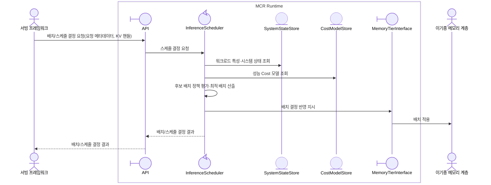
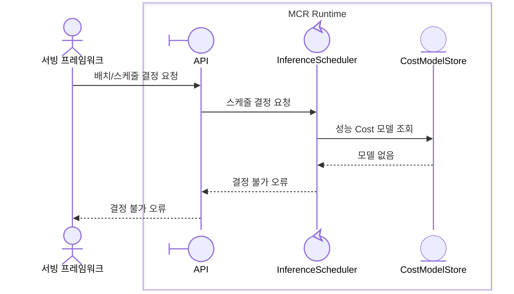

# UC-001-비용-인지-메모리-중심-추론-스케줄링 도메인 분석

## 개요

### Use Case ID
UC-001

### 제목
비용 인지 메모리 중심 추론 스케줄링

## 시퀀스 다이어그램

### 주요 시나리오

```mermaid
sequenceDiagram
  %% primary actor
  actor SVC as 서빙 프레임워크

  box MCR Runtime
    participant API@{ "type" : "boundary" }
    participant InferenceScheduler@{ "type" : "control" }
    participant SystemStateStore@{ "type" : "entity" }
    participant CostModelStore@{ "type" : "entity" }
    participant MemoryTierInterface@{ "type" : "boundary" }
  end

  %% secondary actor
  actor MEM as 이기종 메모리 계층

  SVC->>API: 배치/스케줄 결정 요청(요청 메타데이터, KV 핸들)
  API->>InferenceScheduler: 스케줄 결정 요청
  InferenceScheduler->>SystemStateStore: 워크로드 특성·시스템 상태 조회
  InferenceScheduler->>CostModelStore: 성능 Cost 모델 조회
  InferenceScheduler->>InferenceScheduler: 후보 배치 정책 평가·최적 배치 산출
  InferenceScheduler->>MemoryTierInterface: 배치 결정 반영 지시
  MemoryTierInterface->>MEM: 배치 적용
  InferenceScheduler-->>API: 배치/스케줄 결정 결과
  API-->>SVC: 배치/스케줄 결정 결과
```

### 예외 시나리오 (E1. Cost 모델 이용 불가)

```mermaid
sequenceDiagram
  actor SVC as 서빙 프레임워크
  box MCR Runtime
    participant API@{ "type" : "boundary" }
    participant InferenceScheduler@{ "type" : "control" }
    participant CostModelStore@{ "type" : "entity" }
  end

  SVC->>API: 배치/스케줄 결정 요청
  API->>InferenceScheduler: 스케줄 결정 요청
  InferenceScheduler->>CostModelStore: 성능 Cost 모델 조회
  CostModelStore-->>InferenceScheduler: 모델 없음
  InferenceScheduler-->>API: 결정 불가 오류
  API-->>SVC: 결정 불가 오류
```
