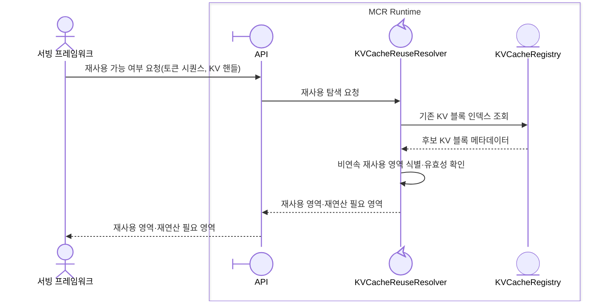
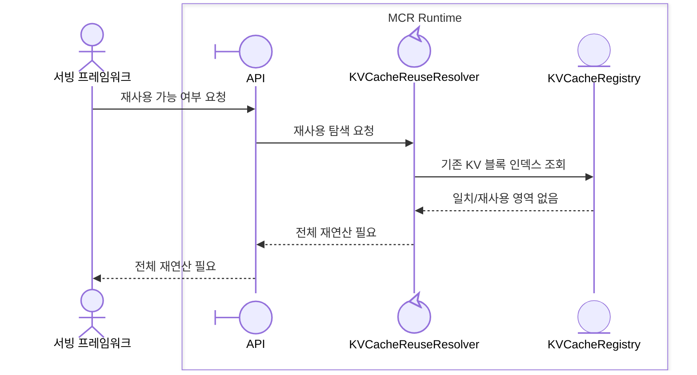

# UC-002-Non-contiguous-KV-캐시-재사용 도메인 분석

## 개요

### Use Case ID
UC-002

### 제목
Non-contiguous KV 캐시 재사용

## 시퀀스 다이어그램

### 주요 시나리오

```mermaid
sequenceDiagram
  %% primary actor
  actor SVC as 서빙 프레임워크

  box MCR Runtime
    participant API@{ "type" : "boundary" }
    participant KVCacheReuseResolver@{ "type" : "control" }
    participant KVCacheRegistry@{ "type" : "entity" }
  end

  SVC->>API: 재사용 가능 여부 요청(토큰 시퀀스, KV 핸들)
  API->>KVCacheReuseResolver: 재사용 탐색 요청
  KVCacheReuseResolver->>KVCacheRegistry: 기존 KV 블록 인덱스 조회
  KVCacheRegistry-->>KVCacheReuseResolver: 후보 KV 블록 메타데이터
  KVCacheReuseResolver->>KVCacheReuseResolver: 비연속 재사용 영역 식별·유효성 확인
  KVCacheReuseResolver-->>API: 재사용 영역·재연산 필요 영역
  API-->>SVC: 재사용 영역·재연산 필요 영역
```

### 대안 시나리오 (2a. 재사용 가능한 영역이 없는 경우)

```mermaid
sequenceDiagram
  actor SVC as 서빙 프레임워크
  box MCR Runtime
    participant API@{ "type" : "boundary" }
    participant KVCacheReuseResolver@{ "type" : "control" }
    participant KVCacheRegistry@{ "type" : "entity" }
  end

  SVC->>API: 재사용 가능 여부 요청
  API->>KVCacheReuseResolver: 재사용 탐색 요청
  KVCacheReuseResolver->>KVCacheRegistry: 기존 KV 블록 인덱스 조회
  KVCacheRegistry-->>KVCacheReuseResolver: 일치/재사용 영역 없음
  KVCacheReuseResolver-->>API: 전체 재연산 필요
  API-->>SVC: 전체 재연산 필요
```
