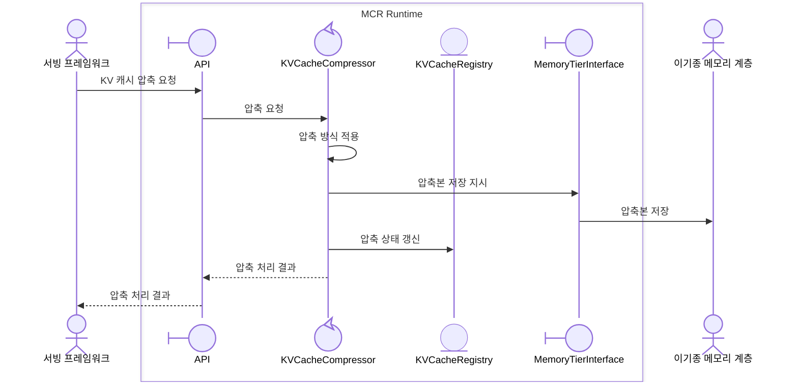
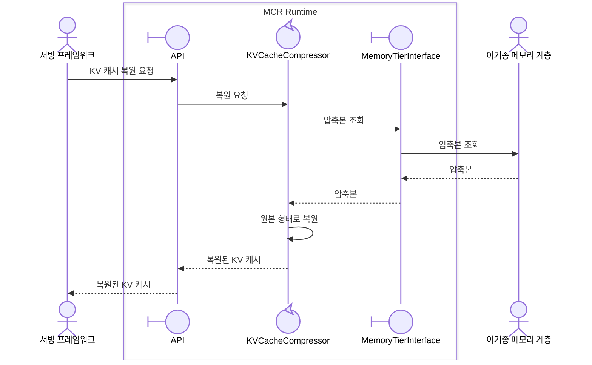

# UC-003-KV-캐시-압축 도메인 분석

## 개요

### Use Case ID
UC-003

### 제목
KV 캐시 압축

## 시퀀스 다이어그램

### 주요 시나리오 (압축)

```mermaid
sequenceDiagram
  %% primary actor
  actor SVC as 서빙 프레임워크

  box MCR Runtime
    participant API@{ "type" : "boundary" }
    participant KVCacheCompressor@{ "type" : "control" }
    participant KVCacheRegistry@{ "type" : "entity" }
    participant MemoryTierInterface@{ "type" : "boundary" }
  end

  %% secondary actor
  actor MEM as 이기종 메모리 계층

  SVC->>API: KV 캐시 압축 요청
  API->>KVCacheCompressor: 압축 요청
  KVCacheCompressor->>KVCacheCompressor: 압축 방식 적용
  KVCacheCompressor->>MemoryTierInterface: 압축본 저장 지시
  MemoryTierInterface->>MEM: 압축본 저장
  KVCacheCompressor->>KVCacheRegistry: 압축 상태 갱신
  KVCacheCompressor-->>API: 압축 처리 결과
  API-->>SVC: 압축 처리 결과
```

### 대안 시나리오 (1a. 복원 요청)

```mermaid
sequenceDiagram
  actor SVC as 서빙 프레임워크
  box MCR Runtime
    participant API@{ "type" : "boundary" }
    participant KVCacheCompressor@{ "type" : "control" }
    participant MemoryTierInterface@{ "type" : "boundary" }
  end
  actor MEM as 이기종 메모리 계층

  SVC->>API: KV 캐시 복원 요청
  API->>KVCacheCompressor: 복원 요청
  KVCacheCompressor->>MemoryTierInterface: 압축본 조회
  MemoryTierInterface->>MEM: 압축본 조회
  MEM-->>MemoryTierInterface: 압축본
  MemoryTierInterface-->>KVCacheCompressor: 압축본
  KVCacheCompressor->>KVCacheCompressor: 원본 형태로 복원
  KVCacheCompressor-->>API: 복원된 KV 캐시
  API-->>SVC: 복원된 KV 캐시
```
