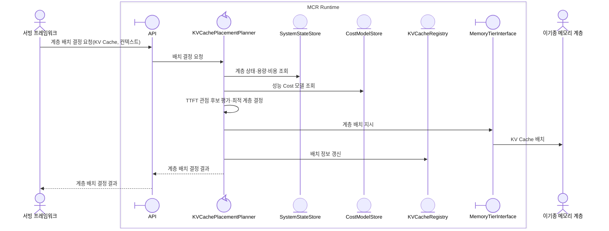
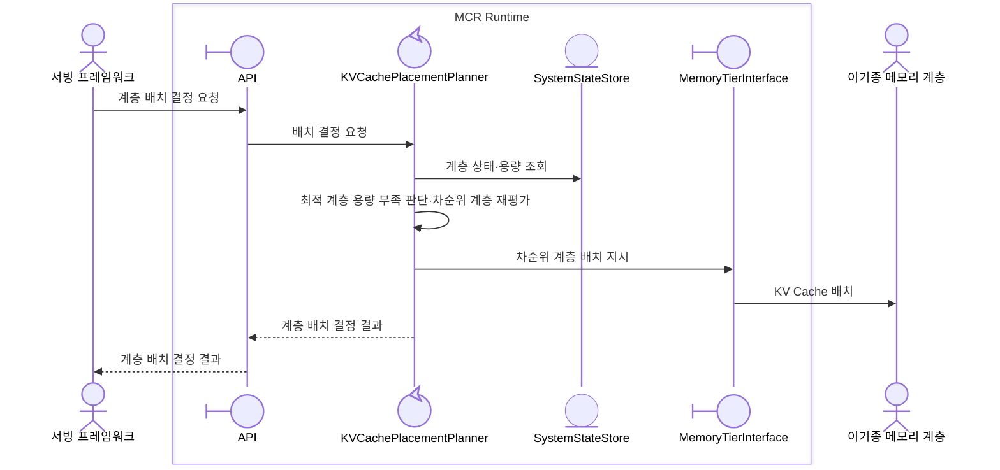

# UC-004-KV-Cache-계층-배치-결정 도메인 분석

## 개요

### Use Case ID
UC-004

### 제목
KV Cache 계층 배치 결정

## 시퀀스 다이어그램

### 주요 시나리오

```mermaid
sequenceDiagram
  %% primary actor
  actor SVC as 서빙 프레임워크

  box MCR Runtime
    participant API@{ "type" : "boundary" }
    participant KVCachePlacementPlanner@{ "type" : "control" }
    participant SystemStateStore@{ "type" : "entity" }
    participant CostModelStore@{ "type" : "entity" }
    participant KVCacheRegistry@{ "type" : "entity" }
    participant MemoryTierInterface@{ "type" : "boundary" }
  end

  %% secondary actor
  actor MEM as 이기종 메모리 계층

  SVC->>API: 계층 배치 결정 요청(KV Cache, 컨텍스트)
  API->>KVCachePlacementPlanner: 배치 결정 요청
  KVCachePlacementPlanner->>SystemStateStore: 계층 상태·용량·비용 조회
  KVCachePlacementPlanner->>CostModelStore: 성능 Cost 모델 조회
  KVCachePlacementPlanner->>KVCachePlacementPlanner: TTFT 관점 후보 평가·최적 계층 결정
  KVCachePlacementPlanner->>MemoryTierInterface: 계층 배치 지시
  MemoryTierInterface->>MEM: KV Cache 배치
  KVCachePlacementPlanner->>KVCacheRegistry: 배치 정보 갱신
  KVCachePlacementPlanner-->>API: 계층 배치 결정 결과
  API-->>SVC: 계층 배치 결정 결과
```

### 대안 시나리오 (4a. 최적 계층 용량 부족)

```mermaid
sequenceDiagram
  actor SVC as 서빙 프레임워크
  box MCR Runtime
    participant API@{ "type" : "boundary" }
    participant KVCachePlacementPlanner@{ "type" : "control" }
    participant SystemStateStore@{ "type" : "entity" }
    participant MemoryTierInterface@{ "type" : "boundary" }
  end
  actor MEM as 이기종 메모리 계층

  SVC->>API: 계층 배치 결정 요청
  API->>KVCachePlacementPlanner: 배치 결정 요청
  KVCachePlacementPlanner->>SystemStateStore: 계층 상태·용량 조회
  KVCachePlacementPlanner->>KVCachePlacementPlanner: 최적 계층 용량 부족 판단·차순위 계층 재평가
  KVCachePlacementPlanner->>MemoryTierInterface: 차순위 계층 배치 지시
  MemoryTierInterface->>MEM: KV Cache 배치
  KVCachePlacementPlanner-->>API: 계층 배치 결정 결과
  API-->>SVC: 계층 배치 결정 결과
```
