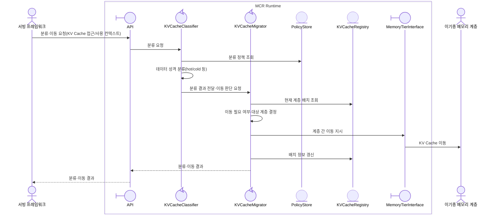
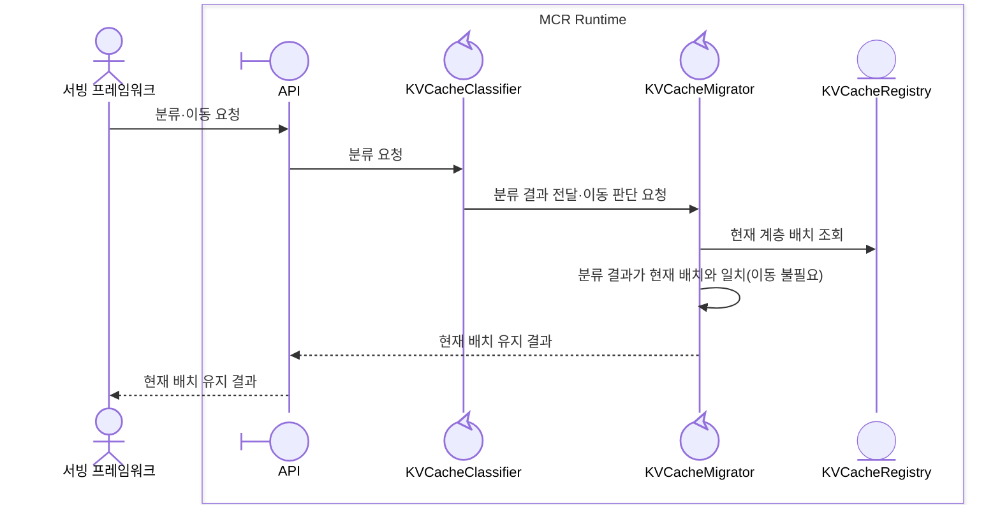

# UC-005-KV-Cache-분류-및-계층-간-이동 도메인 분석

## 개요

### Use Case ID
UC-005

### 제목
KV Cache 분류 및 계층 간 이동

## 시퀀스 다이어그램

### 주요 시나리오

```mermaid
sequenceDiagram
  %% primary actor
  actor SVC as 서빙 프레임워크

  box MCR Runtime
    participant API@{ "type" : "boundary" }
    participant KVCacheClassifier@{ "type" : "control" }
    participant KVCacheMigrator@{ "type" : "control" }
    participant PolicyStore@{ "type" : "entity" }
    participant KVCacheRegistry@{ "type" : "entity" }
    participant MemoryTierInterface@{ "type" : "boundary" }
  end

  %% secondary actor
  actor MEM as 이기종 메모리 계층

  SVC->>API: 분류·이동 요청(KV Cache 접근/사용 컨텍스트)
  API->>KVCacheClassifier: 분류 요청
  KVCacheClassifier->>PolicyStore: 분류 정책 조회
  KVCacheClassifier->>KVCacheClassifier: 데이터 성격 분류(hot/cold 등)
  KVCacheClassifier->>KVCacheMigrator: 분류 결과 전달·이동 판단 요청
  KVCacheMigrator->>KVCacheRegistry: 현재 계층 배치 조회
  KVCacheMigrator->>KVCacheMigrator: 이동 필요 여부·대상 계층 결정
  KVCacheMigrator->>MemoryTierInterface: 계층 간 이동 지시
  MemoryTierInterface->>MEM: KV Cache 이동
  KVCacheMigrator->>KVCacheRegistry: 배치 정보 갱신
  KVCacheMigrator-->>API: 분류·이동 결과
  API-->>SVC: 분류·이동 결과
```

### 대안 시나리오 (3a. 이동 불필요)

```mermaid
sequenceDiagram
  actor SVC as 서빙 프레임워크
  box MCR Runtime
    participant API@{ "type" : "boundary" }
    participant KVCacheClassifier@{ "type" : "control" }
    participant KVCacheMigrator@{ "type" : "control" }
    participant KVCacheRegistry@{ "type" : "entity" }
  end

  SVC->>API: 분류·이동 요청
  API->>KVCacheClassifier: 분류 요청
  KVCacheClassifier->>KVCacheMigrator: 분류 결과 전달·이동 판단 요청
  KVCacheMigrator->>KVCacheRegistry: 현재 계층 배치 조회
  KVCacheMigrator->>KVCacheMigrator: 분류 결과가 현재 배치와 일치(이동 불필요)
  KVCacheMigrator-->>API: 현재 배치 유지 결과
  API-->>SVC: 현재 배치 유지 결과
```
