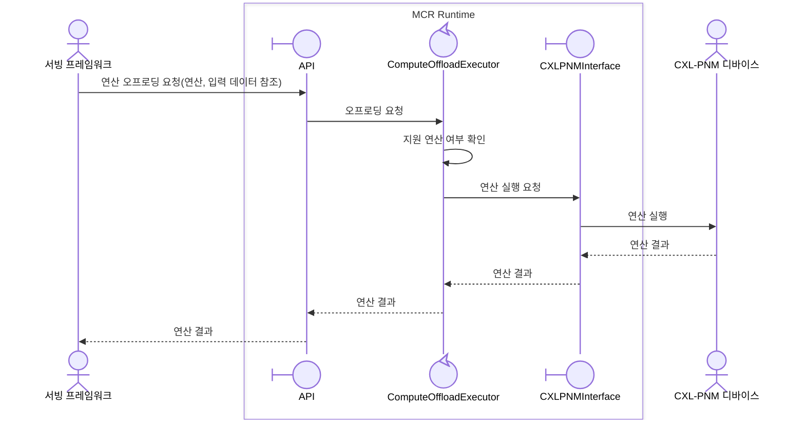
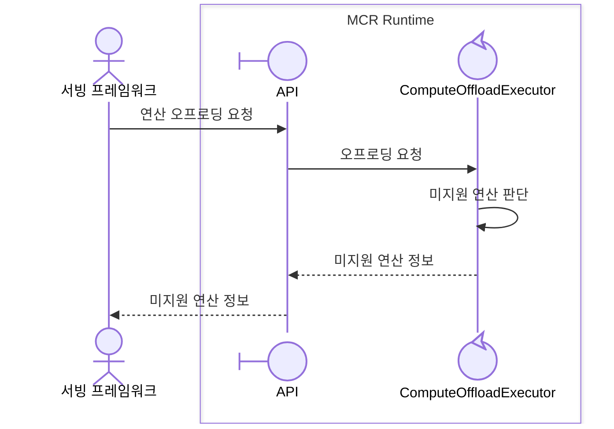

# UC-006-CXL-PNM-연산-오프로딩 도메인 분석

## 개요

### Use Case ID
UC-006

### 제목
CXL-PNM 연산 오프로딩

## 시퀀스 다이어그램

### 주요 시나리오

```mermaid
sequenceDiagram
  %% primary actor
  actor SVC as 서빙 프레임워크

  box MCR Runtime
    participant API@{ "type" : "boundary" }
    participant ComputeOffloadExecutor@{ "type" : "control" }
    participant CXLPNMInterface@{ "type" : "boundary" }
  end

  %% secondary actor
  actor PNM as CXL-PNM 디바이스

  SVC->>API: 연산 오프로딩 요청(연산, 입력 데이터 참조)
  API->>ComputeOffloadExecutor: 오프로딩 요청
  ComputeOffloadExecutor->>ComputeOffloadExecutor: 지원 연산 여부 확인
  ComputeOffloadExecutor->>CXLPNMInterface: 연산 실행 요청
  CXLPNMInterface->>PNM: 연산 실행
  PNM-->>CXLPNMInterface: 연산 결과
  CXLPNMInterface-->>ComputeOffloadExecutor: 연산 결과
  ComputeOffloadExecutor-->>API: 연산 결과
  API-->>SVC: 연산 결과
```

### 예외 시나리오 (E1. 미지원 연산)

```mermaid
sequenceDiagram
  actor SVC as 서빙 프레임워크
  box MCR Runtime
    participant API@{ "type" : "boundary" }
    participant ComputeOffloadExecutor@{ "type" : "control" }
  end

  SVC->>API: 연산 오프로딩 요청
  API->>ComputeOffloadExecutor: 오프로딩 요청
  ComputeOffloadExecutor->>ComputeOffloadExecutor: 미지원 연산 판단
  ComputeOffloadExecutor-->>API: 미지원 연산 정보
  API-->>SVC: 미지원 연산 정보
```
