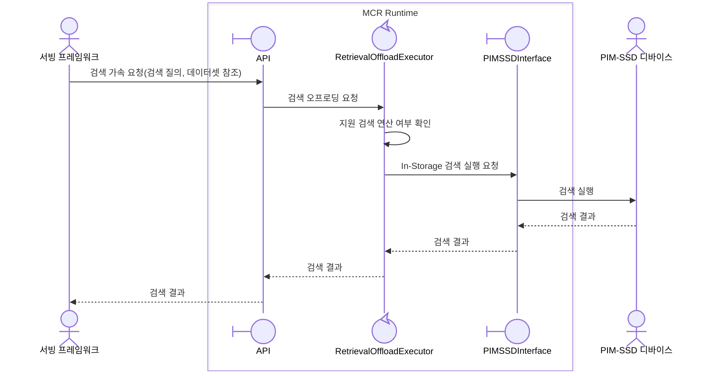
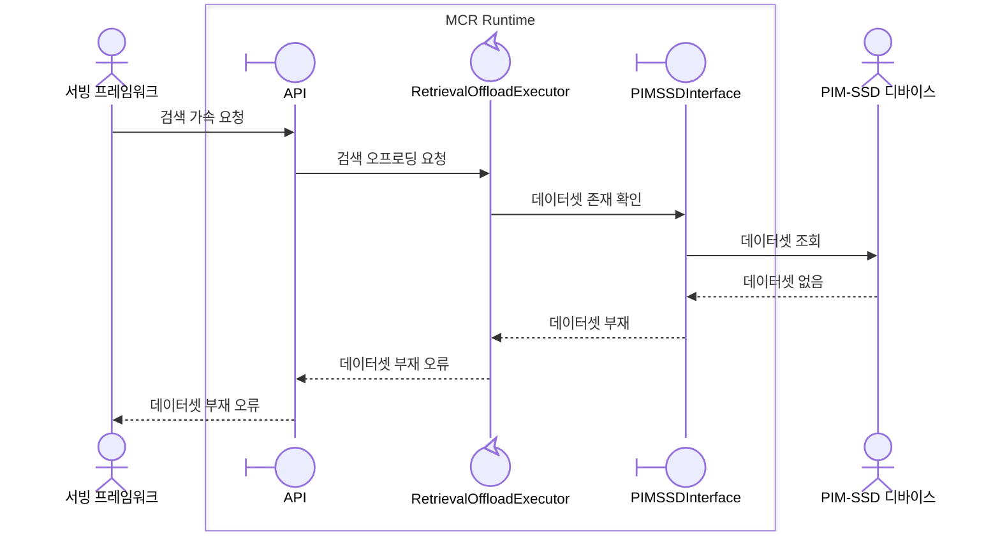

# UC-007-PIM-SSD-Retrieving-가속-오프로딩 도메인 분석

## 개요

### Use Case ID
UC-007

### 제목
PIM-SSD Retrieving 가속 오프로딩

## 시퀀스 다이어그램

### 주요 시나리오

```mermaid
sequenceDiagram
  %% primary actor
  actor SVC as 서빙 프레임워크

  box MCR Runtime
    participant API@{ "type" : "boundary" }
    participant RetrievalOffloadExecutor@{ "type" : "control" }
    participant PIMSSDInterface@{ "type" : "boundary" }
  end

  %% secondary actor
  actor PSSD as PIM-SSD 디바이스

  SVC->>API: 검색 가속 요청(검색 질의, 데이터셋 참조)
  API->>RetrievalOffloadExecutor: 검색 오프로딩 요청
  RetrievalOffloadExecutor->>RetrievalOffloadExecutor: 지원 검색 연산 여부 확인
  RetrievalOffloadExecutor->>PIMSSDInterface: In-Storage 검색 실행 요청
  PIMSSDInterface->>PSSD: 검색 실행
  PSSD-->>PIMSSDInterface: 검색 결과
  PIMSSDInterface-->>RetrievalOffloadExecutor: 검색 결과
  RetrievalOffloadExecutor-->>API: 검색 결과
  API-->>SVC: 검색 결과
```

### 예외 시나리오 (E1. 데이터셋 부재)

```mermaid
sequenceDiagram
  actor SVC as 서빙 프레임워크
  box MCR Runtime
    participant API@{ "type" : "boundary" }
    participant RetrievalOffloadExecutor@{ "type" : "control" }
    participant PIMSSDInterface@{ "type" : "boundary" }
  end
  actor PSSD as PIM-SSD 디바이스

  SVC->>API: 검색 가속 요청
  API->>RetrievalOffloadExecutor: 검색 오프로딩 요청
  RetrievalOffloadExecutor->>PIMSSDInterface: 데이터셋 존재 확인
  PIMSSDInterface->>PSSD: 데이터셋 조회
  PSSD-->>PIMSSDInterface: 데이터셋 없음
  PIMSSDInterface-->>RetrievalOffloadExecutor: 데이터셋 부재
  RetrievalOffloadExecutor-->>API: 데이터셋 부재 오류
  API-->>SVC: 데이터셋 부재 오류
```
