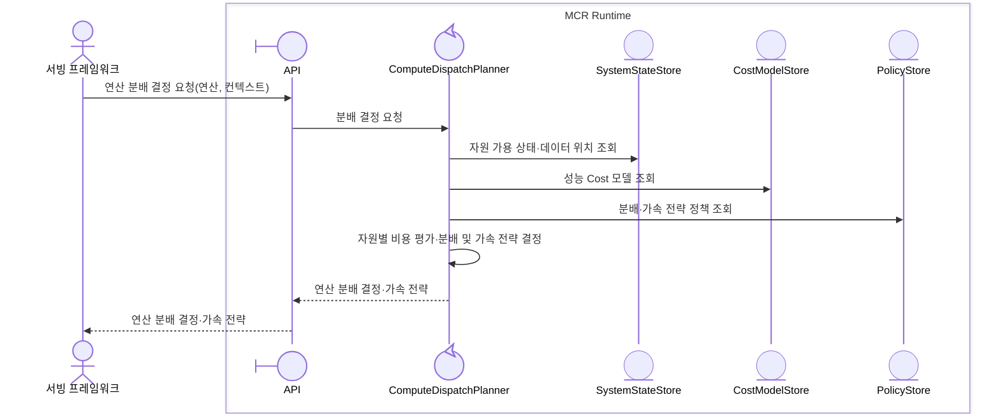
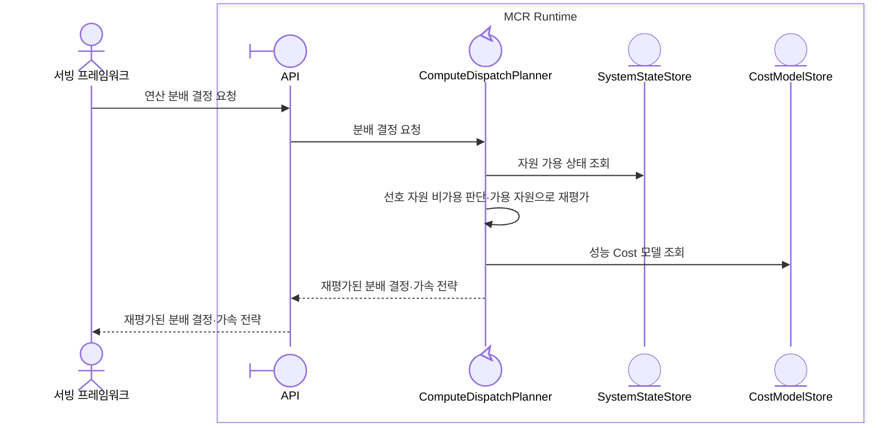

# UC-008-연산-자원-분배-결정 도메인 분석

## 개요

### Use Case ID
UC-008

### 제목
연산 자원 분배 결정

## 시퀀스 다이어그램

### 주요 시나리오

```mermaid
sequenceDiagram
  %% primary actor
  actor SVC as 서빙 프레임워크

  box MCR Runtime
    participant API@{ "type" : "boundary" }
    participant ComputeDispatchPlanner@{ "type" : "control" }
    participant SystemStateStore@{ "type" : "entity" }
    participant CostModelStore@{ "type" : "entity" }
    participant PolicyStore@{ "type" : "entity" }
  end

  SVC->>API: 연산 분배 결정 요청(연산, 컨텍스트)
  API->>ComputeDispatchPlanner: 분배 결정 요청
  ComputeDispatchPlanner->>SystemStateStore: 자원 가용 상태·데이터 위치 조회
  ComputeDispatchPlanner->>CostModelStore: 성능 Cost 모델 조회
  ComputeDispatchPlanner->>PolicyStore: 분배·가속 전략 정책 조회
  ComputeDispatchPlanner->>ComputeDispatchPlanner: 자원별 비용 평가·분배 및 가속 전략 결정
  ComputeDispatchPlanner-->>API: 연산 분배 결정·가속 전략
  API-->>SVC: 연산 분배 결정·가속 전략
```

### 대안 시나리오 (4a. 특정 자원 비가용)

```mermaid
sequenceDiagram
  actor SVC as 서빙 프레임워크
  box MCR Runtime
    participant API@{ "type" : "boundary" }
    participant ComputeDispatchPlanner@{ "type" : "control" }
    participant SystemStateStore@{ "type" : "entity" }
    participant CostModelStore@{ "type" : "entity" }
  end

  SVC->>API: 연산 분배 결정 요청
  API->>ComputeDispatchPlanner: 분배 결정 요청
  ComputeDispatchPlanner->>SystemStateStore: 자원 가용 상태 조회
  ComputeDispatchPlanner->>ComputeDispatchPlanner: 선호 자원 비가용 판단·가용 자원으로 재평가
  ComputeDispatchPlanner->>CostModelStore: 성능 Cost 모델 조회
  ComputeDispatchPlanner-->>API: 재평가된 분배 결정·가속 전략
  API-->>SVC: 재평가된 분배 결정·가속 전략
```
