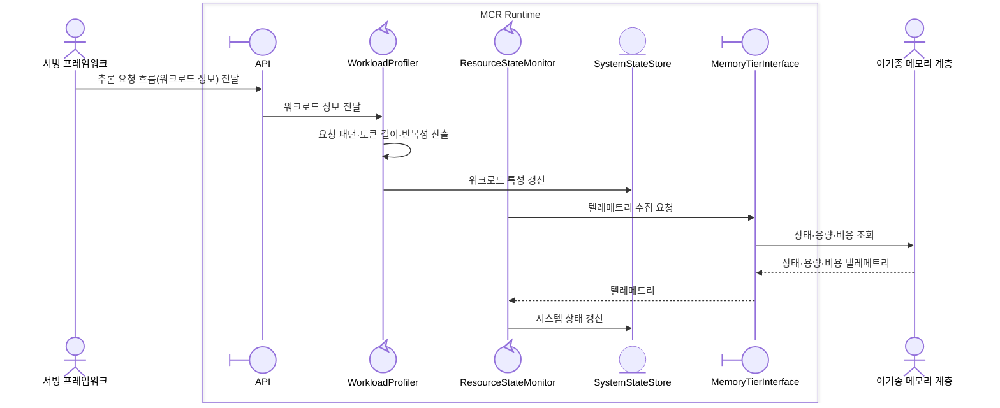
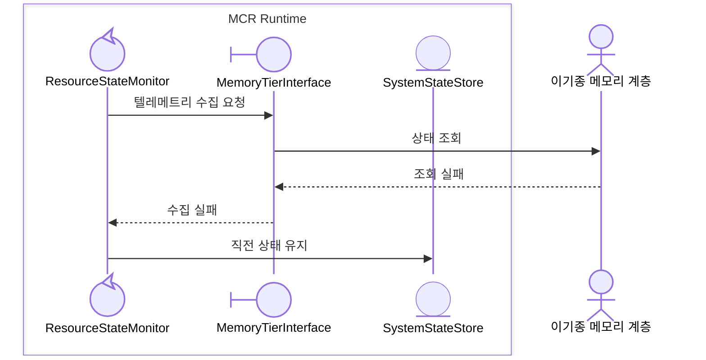

# UC-009-워크로드-특성-인지-및-시스템-상태-모니터링 도메인 분석

## 개요

### Use Case ID
UC-009

### 제목
워크로드 특성 인지 및 시스템 상태 모니터링

## 시퀀스 다이어그램

### 주요 시나리오

```mermaid
sequenceDiagram
  %% primary actor
  actor SVC as 서빙 프레임워크

  box MCR Runtime
    participant API@{ "type" : "boundary" }
    participant WorkloadProfiler@{ "type" : "control" }
    participant ResourceStateMonitor@{ "type" : "control" }
    participant SystemStateStore@{ "type" : "entity" }
    participant MemoryTierInterface@{ "type" : "boundary" }
  end

  %% secondary actor
  actor MEM as 이기종 메모리 계층

  SVC->>API: 추론 요청 흐름(워크로드 정보) 전달
  API->>WorkloadProfiler: 워크로드 정보 전달
  WorkloadProfiler->>WorkloadProfiler: 요청 패턴·토큰 길이·반복성 산출
  WorkloadProfiler->>SystemStateStore: 워크로드 특성 갱신
  ResourceStateMonitor->>MemoryTierInterface: 텔레메트리 수집 요청
  MemoryTierInterface->>MEM: 상태·용량·비용 조회
  MEM-->>MemoryTierInterface: 상태·용량·비용 텔레메트리
  MemoryTierInterface-->>ResourceStateMonitor: 텔레메트리
  ResourceStateMonitor->>SystemStateStore: 시스템 상태 갱신
```

### 예외 시나리오 (E1. 텔레메트리 수집 실패)

```mermaid
sequenceDiagram
  box MCR Runtime
    participant ResourceStateMonitor@{ "type" : "control" }
    participant MemoryTierInterface@{ "type" : "boundary" }
    participant SystemStateStore@{ "type" : "entity" }
  end
  actor MEM as 이기종 메모리 계층

  ResourceStateMonitor->>MemoryTierInterface: 텔레메트리 수집 요청
  MemoryTierInterface->>MEM: 상태 조회
  MEM-->>MemoryTierInterface: 조회 실패
  MemoryTierInterface-->>ResourceStateMonitor: 수집 실패
  ResourceStateMonitor->>SystemStateStore: 직전 상태 유지
```
