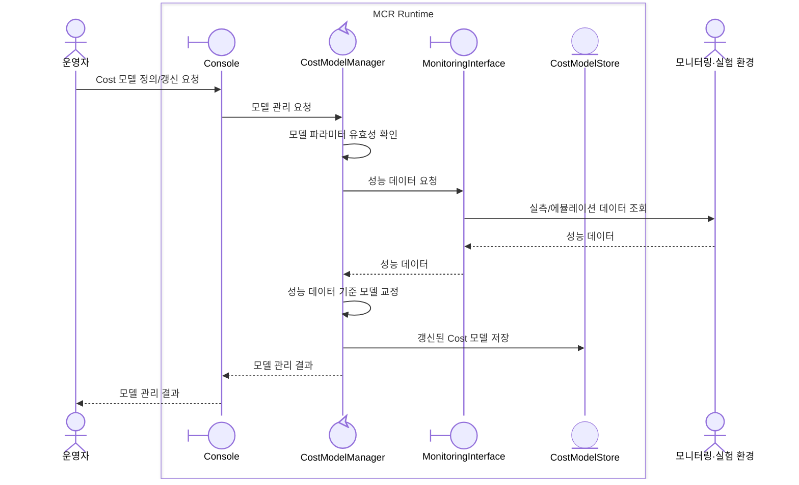
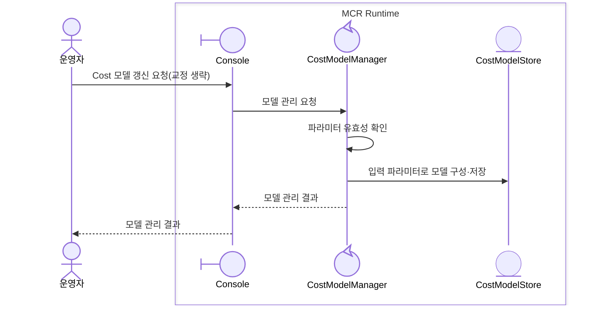

# UC-010-성능-Cost-모델-관리 도메인 분석

## 개요

### Use Case ID
UC-010

### 제목
성능 Cost 모델 관리

## 시퀀스 다이어그램

### 주요 시나리오

```mermaid
sequenceDiagram
  %% primary actor
  actor OPS as 운영자

  box MCR Runtime
    participant Console@{ "type" : "boundary" }
    participant CostModelManager@{ "type" : "control" }
    participant MonitoringInterface@{ "type" : "boundary" }
    participant CostModelStore@{ "type" : "entity" }
  end

  %% secondary actor
  actor OBS as 모니터링·실험 환경

  OPS->>Console: Cost 모델 정의/갱신 요청
  Console->>CostModelManager: 모델 관리 요청
  CostModelManager->>CostModelManager: 모델 파라미터 유효성 확인
  CostModelManager->>MonitoringInterface: 성능 데이터 요청
  MonitoringInterface->>OBS: 실측/에뮬레이션 데이터 조회
  OBS-->>MonitoringInterface: 성능 데이터
  MonitoringInterface-->>CostModelManager: 성능 데이터
  CostModelManager->>CostModelManager: 성능 데이터 기준 모델 교정
  CostModelManager->>CostModelStore: 갱신된 Cost 모델 저장
  CostModelManager-->>Console: 모델 관리 결과
  Console-->>OPS: 모델 관리 결과
```

### 대안 시나리오 (3a. 교정 데이터 미제공)

```mermaid
sequenceDiagram
  actor OPS as 운영자
  box MCR Runtime
    participant Console@{ "type" : "boundary" }
    participant CostModelManager@{ "type" : "control" }
    participant CostModelStore@{ "type" : "entity" }
  end

  OPS->>Console: Cost 모델 갱신 요청(교정 생략)
  Console->>CostModelManager: 모델 관리 요청
  CostModelManager->>CostModelManager: 파라미터 유효성 확인
  CostModelManager->>CostModelStore: 입력 파라미터로 모델 구성·저장
  CostModelManager-->>Console: 모델 관리 결과
  Console-->>OPS: 모델 관리 결과
```
