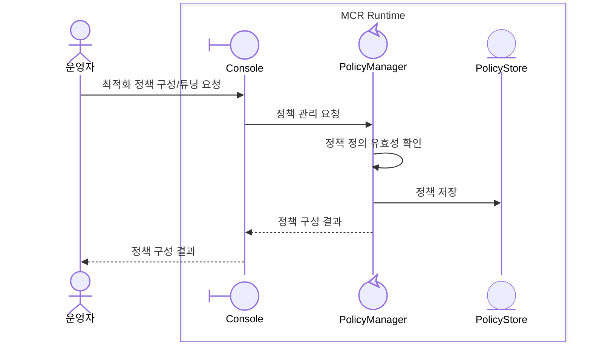
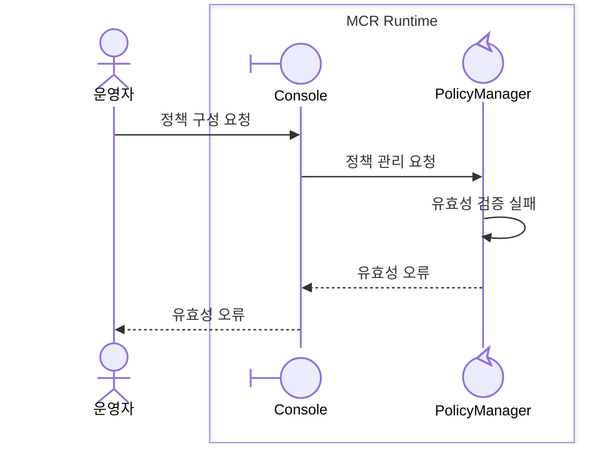

# UC-011-최적화-정책-구성-및-튜닝 도메인 분석

## 개요

### Use Case ID
UC-011

### 제목
최적화 정책 구성 및 튜닝

## 시퀀스 다이어그램

### 주요 시나리오

```mermaid
sequenceDiagram
  %% primary actor
  actor OPS as 운영자

  box MCR Runtime
    participant Console@{ "type" : "boundary" }
    participant PolicyManager@{ "type" : "control" }
    participant PolicyStore@{ "type" : "entity" }
  end

  OPS->>Console: 최적화 정책 구성/튜닝 요청
  Console->>PolicyManager: 정책 관리 요청
  PolicyManager->>PolicyManager: 정책 정의 유효성 확인
  PolicyManager->>PolicyStore: 정책 저장
  PolicyManager-->>Console: 정책 구성 결과
  Console-->>OPS: 정책 구성 결과
```

### 예외 시나리오 (E1. 정책 정의 무효)

```mermaid
sequenceDiagram
  actor OPS as 운영자
  box MCR Runtime
    participant Console@{ "type" : "boundary" }
    participant PolicyManager@{ "type" : "control" }
  end

  OPS->>Console: 정책 구성 요청
  Console->>PolicyManager: 정책 관리 요청
  PolicyManager->>PolicyManager: 유효성 검증 실패
  PolicyManager-->>Console: 유효성 오류
  Console-->>OPS: 유효성 오류
```
