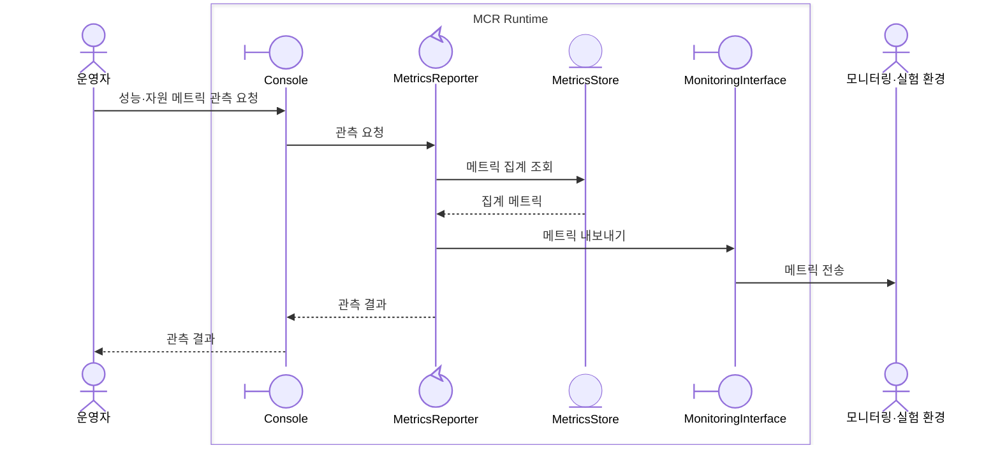
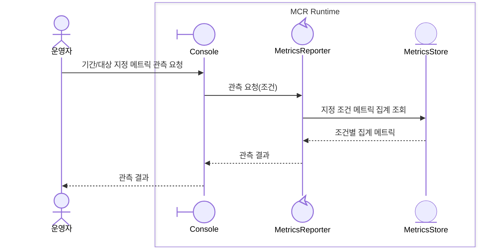

# UC-012-성능-자원-메트릭-관측-및-분석 도메인 분석

## 개요

### Use Case ID
UC-012

### 제목
성능·자원 메트릭 관측 및 분석

## 시퀀스 다이어그램

### 주요 시나리오

```mermaid
sequenceDiagram
  %% primary actor
  actor OPS as 운영자

  box MCR Runtime
    participant Console@{ "type" : "boundary" }
    participant MetricsReporter@{ "type" : "control" }
    participant MetricsStore@{ "type" : "entity" }
    participant MonitoringInterface@{ "type" : "boundary" }
  end

  %% secondary actor
  actor OBS as 모니터링·실험 환경

  OPS->>Console: 성능·자원 메트릭 관측 요청
  Console->>MetricsReporter: 관측 요청
  MetricsReporter->>MetricsStore: 메트릭 집계 조회
  MetricsStore-->>MetricsReporter: 집계 메트릭
  MetricsReporter->>MonitoringInterface: 메트릭 내보내기
  MonitoringInterface->>OBS: 메트릭 전송
  MetricsReporter-->>Console: 관측 결과
  Console-->>OPS: 관측 결과
```

### 대안 시나리오 (1a. 기간/대상 지정 조회)

```mermaid
sequenceDiagram
  actor OPS as 운영자
  box MCR Runtime
    participant Console@{ "type" : "boundary" }
    participant MetricsReporter@{ "type" : "control" }
    participant MetricsStore@{ "type" : "entity" }
  end

  OPS->>Console: 기간/대상 지정 메트릭 관측 요청
  Console->>MetricsReporter: 관측 요청(조건)
  MetricsReporter->>MetricsStore: 지정 조건 메트릭 집계 조회
  MetricsStore-->>MetricsReporter: 조건별 집계 메트릭
  MetricsReporter-->>Console: 관측 결과
  Console-->>OPS: 관측 결과
```
