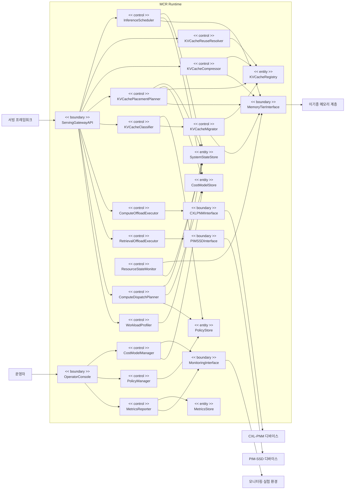

# 도메인 모델

## 개요

### 목적

MCR Runtime의 상세 명세된 Use Case(UC-001~UC-012)를 분석하여, 기능을 제공하기 위한 시스템 내부 컴포넌트를 Boundary/Control/Entity로 식별하고 통합 도메인 모델을 정립한다. 본 모델은 **기능적 요구사항만** 반영하며, 캐싱·비동기 처리·중간 버퍼 등 성능 최적화를 위한 설계 결정은 포함하지 않는다(Phase 4·5에서 품질 요구사항을 고려하여 결정).

### 컴포넌트 분류 체계
- **Boundary**: 사용자(서빙 프레임워크·운영자) 또는 외부 시스템(메모리 계층·디바이스·모니터링 환경)과의 인터페이스
- **Control**: 스케줄링·배치·분류·오프로딩 결정 등 비즈니스 로직 처리, 흐름 제어, 계산
- **Entity**: Cost 모델·정책·KV 캐시 메타데이터·시스템 상태·메트릭 등 영속적 도메인 데이터의 저장 및 관리

> **참고(GPU 연산 실행)**: 비오프로딩 연산의 GPU 실행은 통합 대상인 상위 서빙 프레임워크가 수행하며, MCR Runtime은 분배 결정(UC-008)만 산출한다. 따라서 GPU에 대한 직접 실행 Boundary는 도메인 모델에 두지 않는다.

## 도메인 모델

## Boundary 컴포넌트

### ServingGatewayAPI
- **역할**: 상위 LLM 서빙 프레임워크와의 통합 인터페이스
- **책임**:
  - 추론 요청 메타데이터·KV 캐시 핸들·검색 질의 등 요청 수신
  - 스케줄링·재사용·압축·배치·분류·오프로딩·분배 결정 결과 반환
- **인터페이스**: 서빙 프레임워크(Primary Actor)
- **관련 Use Case**: UC-001, UC-002, UC-003, UC-004, UC-005, UC-006, UC-007, UC-008, UC-009

### OperatorConsole
- **역할**: 운영자를 위한 관리 인터페이스
- **책임**:
  - Cost 모델·정책 구성/튜닝 요청 수신
  - 메트릭 관측 요청 수신 및 결과 반환
- **인터페이스**: 운영자(Primary Actor)
- **관련 Use Case**: UC-010, UC-011, UC-012

### MemoryTierInterface
- **역할**: 이기종 메모리 계층과의 인터페이스
- **책임**:
  - KV 캐시의 배치·이동·압축본 저장 지시
  - 계층 상태·용량·비용 텔레메트리 수집
- **인터페이스**: 이기종 메모리 계층(Secondary Actor)
- **관련 Use Case**: UC-001, UC-003, UC-004, UC-005, UC-009

### CXLPNMInterface
- **역할**: CXL-PNM 디바이스와의 연산 오프로딩 인터페이스
- **책임**: 연산 실행 요청 전달 및 결과 수신
- **인터페이스**: CXL-PNM 디바이스(Secondary Actor)
- **관련 Use Case**: UC-006

### PIMSSDInterface
- **역할**: PIM-SSD 디바이스와의 검색 오프로딩 인터페이스
- **책임**: In-Storage 검색 실행 요청 전달 및 결과 수신
- **인터페이스**: PIM-SSD 디바이스(Secondary Actor)
- **관련 Use Case**: UC-007

### MonitoringInterface
- **역할**: 모니터링·실험 환경(MCR TestBed / QEMU Emulation)과의 인터페이스
- **책임**:
  - Cost 모델 교정용 실측/에뮬레이션 성능 데이터 조회
  - 성능·자원 메트릭 내보내기
- **인터페이스**: 모니터링·실험 환경(Secondary Actor)
- **관련 Use Case**: UC-010, UC-012

## Control 컴포넌트

### InferenceScheduler
- **역할**: 비용 인지 메모리 중심 추론 스케줄링
- **책임**:
  - 워크로드 특성·시스템 상태·Cost 모델 기반 후보 배치 평가
  - KV 캐시·Load의 최적 배치 결정 산출 및 반영 지시
- **처리 로직**: SystemStateStore·CostModelStore 조회 → 정책 평가 → 최적 배치 결정 → MemoryTierInterface 반영
- **관련 Use Case**: UC-001

### KVCacheReuseResolver
- **역할**: 비연속 KV 캐시 재사용 영역 식별
- **책임**: 토큰 위치가 일치하지 않아도 재사용 가능한 영역 탐색·유효성 확인, 재연산 영역 구분
- **처리 로직**: KVCacheRegistry 인덱스 조회 → 재사용 영역 식별 → 재사용/재연산 영역 반환
- **관련 Use Case**: UC-002

### KVCacheCompressor
- **역할**: KV 캐시 압축/복원
- **책임**: 압축 방식 적용 및 복원, 압축 상태 기록
- **처리 로직**: 압축/복원 수행 → MemoryTierInterface 저장/조회 → KVCacheRegistry 상태 갱신
- **관련 Use Case**: UC-003

### KVCachePlacementPlanner
- **역할**: Tiered Memory 내 KV Cache 계층 배치 결정
- **책임**: TTFT 관점의 후보 배치 평가 및 최적 계층 결정
- **처리 로직**: SystemStateStore·CostModelStore 조회 → TTFT 후보 평가 → 계층 결정 → MemoryTierInterface 배치 → KVCacheRegistry 갱신
- **관련 Use Case**: UC-004

### KVCacheClassifier
- **역할**: KV Cache 데이터 성격 분류
- **책임**: 분류 정책 기반 hot/cold 등 데이터 성격 분류
- **처리 로직**: PolicyStore 분류 정책 조회 → 분류 수행 → KVCacheMigrator로 결과 전달
- **관련 Use Case**: UC-005

### KVCacheMigrator
- **역할**: KV Cache 계층 간 이동
- **책임**: 분류 결과와 현재 배치 비교, 이동 필요/대상 계층 결정 및 이동 수행
- **처리 로직**: KVCacheRegistry 현재 배치 조회 → 이동 대상 결정 → MemoryTierInterface 이동 → KVCacheRegistry 갱신
- **관련 Use Case**: UC-005

### ComputeOffloadExecutor
- **역할**: CXL-PNM 연산 오프로딩 실행 제어
- **책임**: 지원 연산 확인 및 오프로딩 실행, 결과 통합
- **처리 로직**: 지원 연산 확인 → CXLPNMInterface 실행 요청 → 결과 반환
- **관련 Use Case**: UC-006

### RetrievalOffloadExecutor
- **역할**: PIM-SSD 검색 오프로딩 실행 제어
- **책임**: 지원 검색 연산 확인 및 In-Storage 검색 실행, 결과 선별
- **처리 로직**: 지원 여부 확인 → PIMSSDInterface 검색 요청 → 결과 반환
- **관련 Use Case**: UC-007

### ComputeDispatchPlanner
- **역할**: 연산 자원 분배 및 가속 전략 결정
- **책임**: GPU·CXL-PNM·PIM-SSD 간 연산 분배와 가속 전략(Pipelining/Tiling/Data Placement) 결정
- **처리 로직**: SystemStateStore·CostModelStore·PolicyStore 조회 → 자원별 비용 평가 → 분배·전략 결정
- **관련 Use Case**: UC-008

### WorkloadProfiler
- **역할**: 워크로드 특성 산출
- **책임**: 요청 패턴·토큰 길이·반복성 등 워크로드 특성 도출 및 갱신
- **처리 로직**: 서빙 요청 흐름 분석 → 워크로드 특성 산출 → SystemStateStore 갱신
- **관련 Use Case**: UC-009

### ResourceStateMonitor
- **역할**: 시스템 상태 모니터링
- **책임**: 메모리 계층 상태·용량·비용 텔레메트리 수집 및 갱신
- **처리 로직**: MemoryTierInterface 텔레메트리 수집 → SystemStateStore 갱신
- **관련 Use Case**: UC-009

### CostModelManager
- **역할**: 성능 Cost 모델 정의·갱신·교정
- **책임**: 모델 파라미터 유효성 확인, 성능 데이터 기반 교정, 모델 반영
- **처리 로직**: 유효성 확인 → MonitoringInterface 성능 데이터 조회 → 교정 → CostModelStore 저장
- **관련 Use Case**: UC-010

### PolicyManager
- **역할**: 최적화 정책 구성·튜닝
- **책임**: 정책 정의 유효성 확인 및 저장·반영
- **처리 로직**: 유효성 확인 → PolicyStore 저장
- **관련 Use Case**: UC-011

### MetricsReporter
- **역할**: 성능·자원 메트릭 집계·관측·내보내기
- **책임**: 메트릭 집계 조회 및 모니터링·실험 환경으로 내보내기
- **처리 로직**: MetricsStore 집계 조회 → MonitoringInterface 내보내기 → 결과 반환
- **관련 Use Case**: UC-012

## Entity 컴포넌트

### CostModelStore
- **역할**: 성능 Cost 모델 저장
- **책임**: 메모리 계층·디바이스 비용 특성을 추상화한 Cost 모델의 영속 저장·조회
- **관리 데이터**: Cost 모델 파라미터, 디바이스/계층별 비용 특성
- **관련 Use Case**: UC-010, UC-001, UC-004, UC-008

### PolicyStore
- **역할**: 최적화 정책 저장
- **책임**: 스케줄링·분류/이동·분배/가속 정책의 영속 저장·조회
- **관리 데이터**: 정책 정의 및 우선순위
- **관련 Use Case**: UC-011, UC-005, UC-008

### KVCacheRegistry
- **역할**: KV 캐시 블록 메타데이터 관리
- **책임**: KV 캐시 블록의 계층 배치 위치, 분류 결과, 압축 상태, 재사용 인덱스 등 메타데이터 저장·조회
- **관리 데이터**: KV 블록 식별자, 배치 계층, 분류/압축 상태, 비연속 재사용 인덱스
- **관련 Use Case**: UC-002, UC-003, UC-004, UC-005

### SystemStateStore
- **역할**: 워크로드 특성 및 시스템 상태 보관
- **책임**: 산출된 워크로드 특성과 수집된 메모리 계층·자원 상태의 보관·조회 (의사결정 컴포넌트의 입력원)
- **관리 데이터**: 워크로드 특성(요청 패턴·토큰 길이·반복성), 계층 상태·용량·비용, 자원 가용 상태
- **관련 Use Case**: UC-009, UC-001, UC-004, UC-008

### MetricsStore
- **역할**: 성능·자원 메트릭 저장
- **책임**: 처리량·TTFT·오프로딩 비율·재사용률 등 메트릭의 저장·집계 조회
- **관리 데이터**: 성능/자원 메트릭 시계열
- **관련 Use Case**: UC-012

---

> **참고**: 본 도메인 모델은 Phase 3 domain-modeler가 `usecase/UC-nnn.md`를 분석하여 정립하였다. 총 6개 Boundary, 14개 Control, 5개 Entity 컴포넌트를 식별하였으며, 기능적 요구사항만 반영하였다. KVCacheRegistry·SystemStateStore는 성능 최적화용 캐시가 아니라 배치·재사용·분류 결정에 필요한 도메인 메타데이터/상태이므로 Entity로 식별하였다. 본 모델은 Phase 4(품질 요구사항 선정)·Phase 5(후보 구조 설계)의 기준 입력으로 사용된다.
