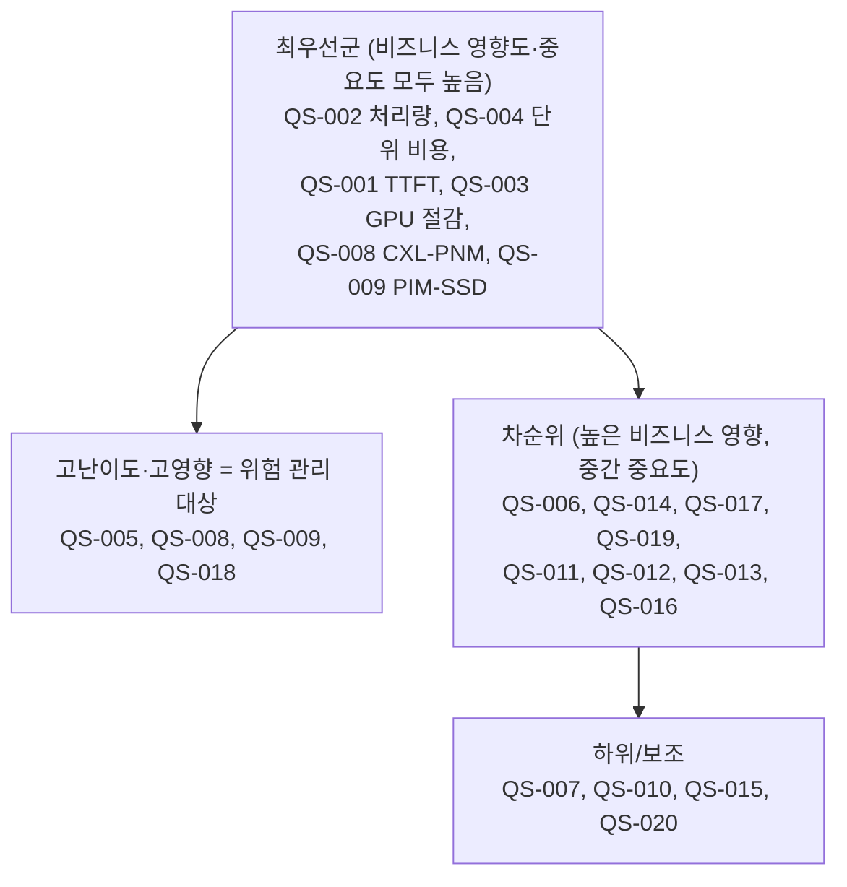

# 품질 시나리오 평가

## 개요

### 목적

Phase 4 quality-specifier가 명세한 품질 시나리오(QS-001~QS-020)를 **중요도(시장)**, **난이도(구현)**, **비즈니스 영향도**의 세 축으로 평가하여, quality-selector의 NFR/QA 선정 의사결정 기반을 제공한다.

### 평가 기준
- **중요도(Importance)**: 시장 요구·경쟁력·사용자 기대 관점의 중요성 (매우 높음/높음/중간/낮음)
- **난이도(Difficulty)**: 기술적 복잡도·리소스·기존 영향 관점의 구현 난이도 (매우 높음/높음/중간/낮음)
- **비즈니스 영향도(Business Impact)**: 비즈니스 목표 달성·차별화·전략적 중요성 (매우 높음/높음/중간/낮음)

> **중요도 ≠ 비즈니스 영향도**: 본 과제는 연구 과제이므로, 시장에서 직접 드러나지 않아도(중요도 낮음/중간) 연구·전략 가치가 큰(비즈니스 영향도 높음) 시나리오가 존재한다(예: QS-018 환경 일관성, QS-011 정책 교체).

## 평가 결과

### QS-001-TTFT
- **중요도**: 매우 높음
  - **평가 근거**: TTFT는 LLM 서빙의 대표적 응답성 지표로, 시장·사용자가 직접 체감하고 기대하는 핵심 품질.
- **난이도**: 높음
  - **평가 근거**: 이기종 메모리 계층 간 KV 배치를 온라인으로 결정해야 하며, 계층별 지연 특성을 반영한 배치 알고리즘이 필요.
- **비즈니스 영향도**: 높음
  - **평가 근거**: business.md의 KPI(TTFT 개선)에 직결되나, 1차 비즈니스 드라이버인 비용 절감의 보조 지표 성격.

### QS-002-추론-처리량
- **중요도**: 매우 높음
  - **평가 근거**: 동일 자원 대비 처리량은 서빙 경쟁력의 핵심 지표.
- **난이도**: 높음
  - **평가 근거**: 스케줄링·재사용·오프로딩의 종합 효과를 포화 부하에서 일관되게 끌어내야 함.
- **비즈니스 영향도**: 매우 높음
  - **평가 근거**: 처리량은 단위 비용(TCO)과 직결되어 1차 비즈니스 드라이버에 직접 기여.

### QS-003-GPU-연산-부하-절감
- **중요도**: 높음
  - **평가 근거**: 시장은 결과(비용·성능)를 보지만, GPU 부하 절감은 그 메커니즘으로서 중요.
- **난이도**: 높음
  - **평가 근거**: 오프로딩과 재사용을 결합해 정확성을 유지하며 GPU 연산을 줄이는 것이 까다로움.
- **비즈니스 영향도**: 매우 높음
  - **평가 근거**: GPU 부하 절감은 비용 절감과 Computable-Memory 디바이스 가치 실증의 직접적 근거.

### QS-004-추론-단위-비용-효율
- **중요도**: 매우 높음
  - **평가 근거**: 추론 TCO 절감은 시장의 가장 강력한 요구.
- **난이도**: 높음
  - **평가 근거**: 자원 단가·배치·분배를 종합한 비용 인지 의사결정이 필요.
- **비즈니스 영향도**: 매우 높음
  - **평가 근거**: business.md의 최우선 KPI(추론 단위 비용 절감률)와 정확히 일치하는 핵심 지표.

### QS-005-KV-재사용-적중률
- **중요도**: 높음
  - **평가 근거**: 재사용은 처리량·비용에 기여하나 시장이 직접 보는 지표는 아님.
- **난이도**: 매우 높음
  - **평가 근거**: 토큰 위치 불일치를 허용하는 Non-contiguous 재사용은 검증되지 않은 신규 알고리즘 영역.
- **비즈니스 영향도**: 높음
  - **평가 근거**: 재연산·메모리 절감으로 비용 절감에 기여하는 차별화 기술.

### QS-006-KV-메모리-풋프린트-절감
- **중요도**: 높음
  - **평가 근거**: 긴 컨텍스트 워크로드에서 메모리 풋프린트는 중요한 제약.
- **난이도**: 높음
  - **평가 근거**: 압축률과 복원 정확성·비용 간 트레이드오프 관리가 필요.
- **비즈니스 영향도**: 높음
  - **평가 근거**: 메모리 비용 절감과 대용량 컨텍스트 수용에 기여.

### QS-007-온라인-의사결정-오버헤드
- **중요도**: 높음
  - **평가 근거**: 의사결정 오버헤드가 크면 최적화 이득이 상쇄되어, 시스템 제약(필수 만족)에 해당.
- **난이도**: 높음
  - **평가 근거**: 정교한 비용 평가를 경량으로 수행해야 하는 상충 요구.
- **비즈니스 영향도**: 중간
  - **평가 근거**: 직접적 가치라기보다 다른 성능 이득을 보전하는 인에이블러/제약 성격.

### QS-008-CXL-PNM-오프로딩-처리-시간
- **중요도**: 높음
  - **평가 근거**: 오프로딩 처리 성능은 가속 효과의 직접 척도.
- **난이도**: 매우 높음
  - **평가 근거**: CXL-PNM 디바이스 사양·드라이버에 종속되며 검증되지 않은 미성숙 기술.
- **비즈니스 영향도**: 매우 높음
  - **평가 근거**: CXL-PNM 디바이스의 기술적 가치 실증이라는 핵심 비즈니스 목표에 직결.

### QS-009-PIM-SSD-검색-지연
- **중요도**: 높음
  - **평가 근거**: RAG·긴 컨텍스트 검색 수요 확대로 검색 지연의 시장 중요성 상승.
- **난이도**: 매우 높음
  - **평가 근거**: PIM-SSD In-Storage 검색은 신규 추가된 미검증 영역으로 불확실성이 큼.
- **비즈니스 영향도**: 매우 높음
  - **평가 근거**: PIM-SSD 디바이스 가속 가치 실증(신규 initiative)이라는 전략 목표에 직결.

### QS-010-마이그레이션-추론-경로-영향
- **중요도**: 중간
  - **평가 근거**: 내부 최적화 동작으로 시장이 직접 체감하지 않음.
- **난이도**: 높음
  - **평가 근거**: 마이그레이션을 추론 경로 방해 없이 수행하는 설계가 까다로움.
- **비즈니스 영향도**: 중간
  - **평가 근거**: TTFT/처리량 보전에 간접 기여.

### QS-011-최적화-정책-교체-비용
- **중요도**: 중간
  - **평가 근거**: 정책 교체 용이성은 시장이 직접 보는 품질이 아님.
- **난이도**: 중간
  - **평가 근거**: 정책 분리(플러그형) 설계로 달성 가능한 표준적 변경 용이성.
- **비즈니스 영향도**: 높음
  - **평가 근거**: 연구 과제 특성상 다수 알고리즘·정책을 빠르게 실험·교체하는 능력이 연구 생산성에 핵심(중요도와 차이).

### QS-012-신규-계층-디바이스-추가-비용
- **중요도**: 중간
  - **평가 근거**: 확장 용이성은 시장의 직접 요구가 아님.
- **난이도**: 높음
  - **평가 근거**: 이기종 디바이스 추상화와 Cost 모델 확장이 필요.
- **비즈니스 영향도**: 높음
  - **평가 근거**: 차세대 CXL-PNM/PIM-SSD 로드맵과 동반 발전하는 수직 통합 전략에 기여.

### QS-013-Cost-모델-교체-교정-비용
- **중요도**: 중간
  - **평가 근거**: 시장이 직접 보는 품질은 아님.
- **난이도**: 중간
  - **평가 근거**: Cost 모델을 결정 로직과 분리하면 달성 가능.
- **비즈니스 영향도**: 높음
  - **평가 근거**: Cost 모델 정확도가 모든 결정 품질을 좌우하며, 환경(TestBed↔Emulation)별 교정 능력이 연구 신뢰성에 핵심.

### QS-014-신규-서빙-프레임워크-통합-비용
- **중요도**: 높음
  - **평가 근거**: 기존 서빙 스택과의 통합성은 도입 장벽을 낮추는 시장 요인.
- **난이도**: 중간
  - **평가 근거**: ServingGatewayAPI 추상화로 대응 가능.
- **비즈니스 영향도**: 높음
  - **평가 근거**: 생태계 적합성·시장 채택 가능성(중기 목표)에 직접 기여.

### QS-015-메모리-계층-확장-대응
- **중요도**: 중간
  - **평가 근거**: 확장성은 시장의 직접 요구라기보다 기술 일반 요건.
- **난이도**: 높음
  - **평가 근거**: 계층 수 증가 시 결정 시간·품질을 유지하는 알고리즘 확장성 확보가 필요.
- **비즈니스 영향도**: 중간
  - **평가 근거**: 장기 확장 대응에 기여하나 단기 핵심은 아님.

### QS-016-대용량-데이터셋-검색-확장
- **중요도**: 중간
  - **평가 근거**: 대용량 검색 확장은 RAG 시장에서 점증하는 요구.
- **난이도**: 높음
  - **평가 근거**: PIM-SSD 검색 처리량의 데이터 규모 확장성 확보가 필요.
- **비즈니스 영향도**: 높음
  - **평가 근거**: PIM-SSD 가치 실증 및 RAG 워크로드 대응에 기여.

### QS-017-서빙-프레임워크-확장-지점-통합-적합성
- **중요도**: 높음
  - **평가 근거**: 본체 수정 최소화 통합은 시장 도입 가능성에 영향.
- **난이도**: 중간
  - **평가 근거**: 표준 확장 지점(훅·API) 범위 내 설계로 달성 가능.
- **비즈니스 영향도**: 높음
  - **평가 근거**: 낮은 도입 장벽이라는 경쟁력 요인·중기 목표(통합 검증)에 기여.

### QS-018-TestBed-Emulation-일관성
- **중요도**: 낮음
  - **평가 근거**: 검증 환경 일관성은 시장이 보는 품질이 아님.
- **난이도**: 매우 높음
  - **평가 근거**: 실측과 QEMU 에뮬레이션 간 성능 모델 일관성 확보는 본질적으로 어려운 문제.
- **비즈니스 영향도**: 높음
  - **평가 근거**: 단계적 검증 방법론(System Modeling→실측→Emulation) 전체의 신뢰성이 이 일관성에 달려 있음(중요도와 큰 차이).

### QS-019-KV-재사용-정확성
- **중요도**: 높음
  - **평가 근거**: 잘못된 재사용은 추론 결과 오류로 이어져 사용자 기대를 직접 훼손.
- **난이도**: 높음
  - **평가 근거**: 위치 불일치 재사용의 무결성을 보장하는 검증 메커니즘이 필요.
- **비즈니스 영향도**: 높음
  - **평가 근거**: 재사용 기능(QS-005)의 사용 가능 여부를 결정하는 정확성 게이트.

### QS-020-오프로딩-실패-처리-신뢰성
- **중요도**: 중간
  - **평가 근거**: 연구 단계에서는 프로덕션 가용성만큼의 시장 요구는 아님.
- **난이도**: 중간
  - **평가 근거**: 실패 감지·오류 반환·복구 경로 설계로 대응 가능.
- **비즈니스 영향도**: 중간
  - **평가 근거**: 디바이스 미성숙 환경에서 실험 안정성에 기여하나 단기 핵심 가치는 아님.

## 종합 분석

### 중요도-비즈니스 영향도 매트릭스

(행: 비즈니스 영향도 / 열: 중요도)

| 비즈니스 영향도 \ 중요도 | 매우 높음 | 높음 | 중간 | 낮음 |
|----------------|----------|------|------|------|
| **매우 높음** | QS-002, QS-004 | QS-003, QS-008, QS-009 | - | - |
| **높음** | QS-001 | QS-005, QS-006, QS-014, QS-017, QS-019 | QS-011, QS-012, QS-013, QS-016 | QS-018 |
| **중간** | - | QS-007 | QS-010, QS-015, QS-020 | - |
| **낮음** | - | - | - | - |

### 난이도 분포 (위험·불확실성 식별)

- **매우 높음(검증되지 않은 핵심 영역)**: QS-005(Non-contiguous 재사용), QS-008(CXL-PNM 오프로딩), QS-009(PIM-SSD 검색), QS-018(환경 일관성)
- **높음**: QS-001, QS-002, QS-003, QS-004, QS-006, QS-007, QS-010, QS-012, QS-015, QS-016, QS-019
- **중간**: QS-011, QS-013, QS-014, QS-017, QS-020

### 우선순위 분석

- **최우선군**: 성능·비용·디바이스 가치 실증 직결 시나리오(QS-001/002/003/004/008/009)는 NFR(허용치 필요) 및 최우선 QA 후보.
- **위험 관리 대상**: 난이도 "매우 높음"이면서 비즈니스 영향도가 높은 QS-005·008·009·018은 설계 포인트 도출 시 Risk로 다루어야 함.
- **중요도≠비즈니스 영향도 사례**: QS-018(환경 일관성)·QS-011~013(변경 용이성)은 시장 중요도는 낮음/중간이나 연구·전략 비즈니스 영향도가 높아 선정 시 고려 필요.
- **보조 시나리오**: QS-007·010·015·020은 인에이블러/제약 성격으로, 핵심 QA를 보전하는 관점에서 선정.

---

> **참고**: 본 문서는 Phase 4 quality-evaluator가 QS-001~QS-020을 평가한 결과이다. 본 평가(중요도·난이도·비즈니스 영향도)는 `quality-selector`(`/agentk/select-scenarios`)가 NFR/QA를 선정하고 허용치·우선순위를 설정하는 입력으로 사용된다. 난이도 "매우 높음" 시나리오는 이후 설계 포인트 도출(`/agentk/derive-design-points`)에서 Risk 기준으로 재활용된다.
