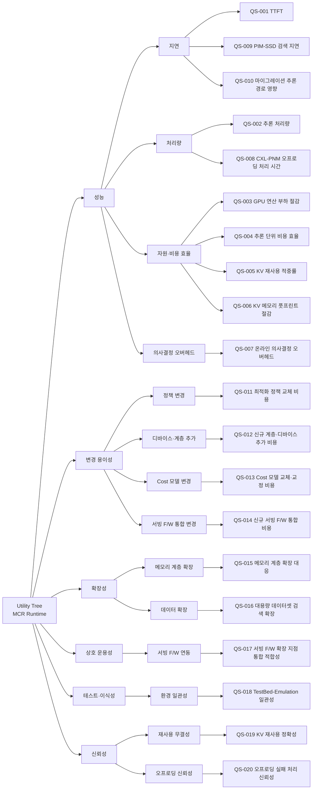

# 품질 시나리오 목록

## 개요

### 목적

`system.md`(시스템 목적·범위·제약), `business.md`(비즈니스 목표·드라이버·KPI), `usecases.md`(핵심 ASR Use Case), `domain/model.md`(도메인 컴포넌트)를 분석하여, MCR Runtime의 구조 설계에 영향을 미치는 **측정 가능한 품질 시나리오**를 도출한다. 본 문서는 Phase 4의 첫 산출물이며, 이후 명세(quality-specifier)·평가(quality-evaluator)·선정(quality-selector)의 입력이 된다.

### 생성 기준

- **비즈니스 목표 연관성**: 추론 단위 비용 절감, 처리량·TTFT 개선, Computable-Memory 디바이스 가속 가치 실증
- **ASR Use Case 연관성**: 핵심 ASR(UC-001·002·004·005·006·007·008·010)에서 요구되는 품질
- **시스템 제약 연관성**: 이기종 메모리 혼재, 서빙 F/W 통합 제약, 온라인 의사결정 오버헤드, 검증 환경 이원화(TestBed↔QEMU)
- **컴포넌트 특성**: 스케줄러·배치·오프로딩·Cost 모델 등 도메인 컴포넌트의 품질 특성
- **측정 가능성**: 모든 시나리오는 측정 방법으로 정의 (목표값/허용치는 본 단계에서 설정하지 않음 — 선정 단계에서 결정)

> 본 시스템은 본질적으로 **성능·자원/비용 효율 최적화 런타임**이므로 성능 관련 시나리오가 다수를 차지한다.

## Utility Tree

### 품질 속성 계층 구조

## 품질 시나리오 목록

### 성능 (Performance)

#### QS-001-TTFT
- **품질 속성**: 성능 (지연)
- **설명**: 추론 요청에 대해 첫 토큰이 생성되기까지의 시간(Time To First Token). Tiered Memory 내 KV Cache 배치(UC-004)의 핵심 목표.
- **측정 방법**: 추론 요청 도착 시점부터 첫 토큰 생성 완료 시점까지의 경과 시간

#### QS-002-추론-처리량
- **품질 속성**: 성능 (처리량)
- **설명**: 동일 자원 기준 End-to-End 추론 처리량. 스케줄링·재사용·오프로딩의 종합 효과.
- **측정 방법**: 단위 시간당 생성 토큰 수(tokens/s) 또는 완료 요청 수

#### QS-003-GPU-연산-부하-절감
- **품질 속성**: 성능 (자원 효율)
- **설명**: Computable-Memory 오프로딩(UC-006/007) 및 KV 재사용(UC-002) 적용 시 GPU 연산 부하 절감 정도.
- **측정 방법**: Baseline(GPU 중심) 대비 GPU 연산량(FLOPs) 또는 GPU 점유 시간의 감소 비율

#### QS-004-추론-단위-비용-효율
- **품질 속성**: 성능 (비용 효율)
- **설명**: 동일 처리량을 달성하는 데 소요되는 GPU·메모리 자원 비용. 핵심 비즈니스 KPI(추론 TCO 절감)와 직결.
- **측정 방법**: 처리량 대비 자원 비용 (예: 토큰당 또는 요청당 GPU+메모리 비용)

#### QS-005-KV-재사용-적중률
- **품질 속성**: 성능 (자원 효율)
- **설명**: Non-contiguous KV 캐시 재사용(UC-002)으로 재연산 없이 재사용된 KV 비율.
- **측정 방법**: 전체 KV 요구량 대비 재사용으로 충족된 KV 비율(재사용 적중률)

#### QS-006-KV-메모리-풋프린트-절감
- **품질 속성**: 성능 (자원 효율)
- **설명**: KV 캐시 압축(UC-003) 적용 시 메모리 풋프린트 절감 정도.
- **측정 방법**: 압축 전후 KV 캐시 메모리 사용량의 비율(압축률)

#### QS-007-온라인-의사결정-오버헤드
- **품질 속성**: 성능 (의사결정 오버헤드)
- **설명**: 스케줄링·배치·분배·이동 결정(UC-001/004/005/008) 산출에 소요되는 런타임 오버헤드. 시스템 제약상 추론 지연(특히 TTFT)을 상쇄하지 않아야 함.
- **측정 방법**: 결정 1회 산출에 소요되는 시간 및 추론 경로에 추가되는 지연

#### QS-008-CXL-PNM-오프로딩-처리-시간
- **품질 속성**: 성능 (처리량/지연)
- **설명**: Attention 등 연산을 CXL-PNM으로 오프로딩(UC-006)했을 때의 연산 처리 시간.
- **측정 방법**: 오프로딩된 연산의 요청~결과 반환까지의 시간

#### QS-009-PIM-SSD-검색-지연
- **품질 속성**: 성능 (지연)
- **설명**: 대용량 데이터 검색을 PIM-SSD로 In-Storage 오프로딩(UC-007)했을 때의 검색 지연.
- **측정 방법**: 검색 질의 전달부터 결과 반환까지의 시간

#### QS-010-마이그레이션-추론-경로-영향
- **품질 속성**: 성능 (지연)
- **설명**: KV Cache 계층 간 이동(UC-005)이 진행 중인 추론 경로(TTFT·처리량)에 미치는 지연 영향.
- **측정 방법**: 마이그레이션 활성 구간과 비활성 구간의 TTFT/처리량 차이

### 변경 용이성 (Modifiability)

#### QS-011-최적화-정책-교체-비용
- **품질 속성**: 변경 용이성
- **설명**: 스케줄링·분류/이동·오프로딩 정책(UC-011)을 교체·추가할 때의 변경 비용.
- **측정 방법**: 정책 1건 교체 시 영향받는 모듈 수/코드 변경 규모

#### QS-012-신규-계층-디바이스-추가-비용
- **품질 속성**: 변경 용이성
- **설명**: 신규 메모리 계층 또는 Computable-Memory 디바이스(차세대 CXL-PNM/PIM-SSD)를 추가할 때의 변경 비용.
- **측정 방법**: 디바이스/계층 1종 추가 시 영향받는 모듈 수/코드 변경 규모

#### QS-013-Cost-모델-교체-교정-비용
- **품질 속성**: 변경 용이성
- **설명**: 성능 Cost 모델(UC-010)을 교체·교정할 때 결정 로직(UC-001/004/008)에 미치는 변경 비용.
- **측정 방법**: Cost 모델 변경 시 영향받는 모듈 수/코드 변경 규모

#### QS-014-신규-서빙-프레임워크-통합-비용
- **품질 속성**: 변경 용이성
- **설명**: 통합 대상 LLM 서빙 프레임워크를 변경(예: vLLM↔SGLang)하거나 신규 통합할 때의 비용.
- **측정 방법**: 서빙 F/W 1종 통합/교체 시 영향받는 모듈 수/코드 변경 규모

### 확장성 (Scalability)

#### QS-015-메모리-계층-확장-대응
- **품질 속성**: 확장성
- **설명**: 메모리 계층 수/용량이 증가할 때 스케줄링·배치 결정의 성능 유지 정도.
- **측정 방법**: 계층 수 증가에 따른 결정 시간 및 처리량 변화 추이

#### QS-016-대용량-데이터셋-검색-확장
- **품질 속성**: 확장성
- **설명**: PIM-SSD 검색 대상 데이터셋이 증가할 때 검색 처리량의 확장성.
- **측정 방법**: 데이터셋 크기 증가에 따른 검색 처리량/지연 변화 추이

### 상호 운용성 (Interoperability)

#### QS-017-서빙-프레임워크-확장-지점-통합-적합성
- **품질 속성**: 상호 운용성
- **설명**: 기존 서빙 프레임워크가 제공하는 확장 지점(스케줄러 훅, KV 캐시 관리 API) 범위 내에서 통합되는 적합성(본체 수정 최소화).
- **측정 방법**: 통합을 위해 서빙 F/W 본체에 가해야 하는 수정량 및 표준 확장 지점 활용 비율

### 테스트·이식성 (Testability / Portability)

#### QS-018-TestBed-Emulation-일관성
- **품질 속성**: 테스트 용이성 / 이식성
- **설명**: 실측(MCR TestBed)과 에뮬레이션(QEMU) 양 환경에서 동작·평가할 때의 성능 모델/결과 일관성. 검증 환경 이원화 제약 대응.
- **측정 방법**: 동일 알고리즘에 대한 두 환경의 성능 측정 결과 편차

### 신뢰성 (Reliability)

#### QS-019-KV-재사용-정확성
- **품질 속성**: 신뢰성
- **설명**: Non-contiguous 재사용(UC-002) 시 토큰 위치 불일치 재사용의 결과 무결성.
- **측정 방법**: 재사용 적용 결과와 정상 재연산 결과의 불일치(오류) 발생률

#### QS-020-오프로딩-실패-처리-신뢰성
- **품질 속성**: 신뢰성
- **설명**: CXL-PNM/PIM-SSD 오프로딩(UC-006/007) 실패 시 정상 결과 반환 또는 복구의 신뢰성.
- **측정 방법**: 디바이스 실패 주입 시 올바른 오류 반환/복구 성공률

---

> **참고**: 본 문서는 Phase 4 quality-elicitor가 도출한 품질 시나리오 목록(QS-001~QS-020)이다. 목표값/허용치는 설정하지 않았으며, 각 시나리오의 측정 가능한 상세 명세는 `quality-specifier`(`/agentk/specify-scenario`)가 `quality/QS-nnn.md`로 작성한다. 이후 `quality-evaluator`가 중요도·난이도·비즈니스 영향도를 평가하고, `quality-selector`가 NFR/QA로 선정한다.
