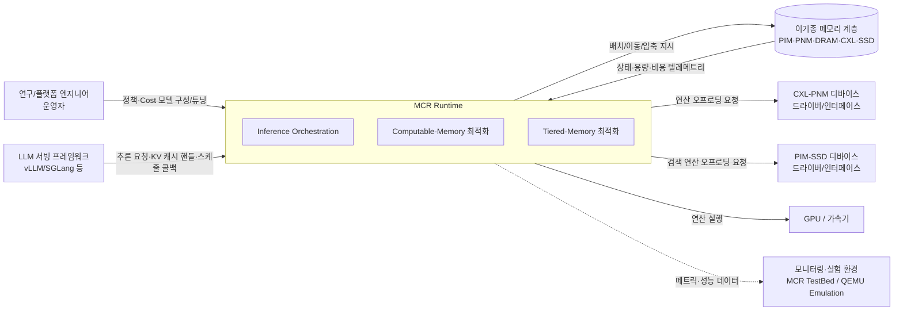

# 시스템 정의

## 시스템 개요

### 시스템 이름

AI Runtime Framework for Memory-Centric System (이하 **MCR Runtime**)

### 시스템 목적

PIM/PNM, 시스템 메모리(DRAM), CXL 확장 메모리, SSD가 혼재된 **이기종 메모리 계층(Memory-Centric System)** 위에서 LLM 추론을 수행할 때, 워크로드 특성과 시스템 상태를 인지하여 자원 할당과 데이터 이동/연산 비용을 최소화하는 **런타임 메커니즘**을 제공한다.

GPU 연산을 최소화하고 KV 캐시의 배치·재사용·압축을 동적으로 최적화함으로써, 기존 LLM 서빙 프레임워크의 End-to-End 추론 처리량과 시스템 효율을 극대화하는 것을 목적으로 한다.

### 시스템이 해결하려는 문제

- **이기종 메모리 대응 부재**: 기존 LLM 서빙 스택은 GPU HBM 중심으로 설계되어, PIM/PNM·CXL·SSD 등 서로 다른 대역폭·지연·용량·비용 특성을 가진 메모리 계층을 통합적으로 활용하지 못한다.
- **정적·비용 비인지 스케줄링**: 요청 패턴·토큰 길이·반복성 등 워크로드 특성과 메모리 계층의 실시간 상태(용량·비용)를 반영하지 못한 채 자원을 배치하여, 데이터 이동/연산 비용이 비효율적으로 발생한다.
- **KV 캐시 활용 한계**: KV 캐시의 재사용이 토큰 위치 일치 조건에 묶여 있고, 압축·계층 간 이동·분류 정책이 부재하여 메모리 풋프린트와 TTFT(Time To First Token)가 악화된다.

MCR Runtime은 위 문제를 **비용 인지(cost-aware) 메모리 중심 스케줄링**, **KV 캐시 최적화(재사용/압축/분류/이동)**, **Computable-Memory(CXL-PNM) 연산 오프로딩**으로 해결한다.

## 시스템 범위

### 포함 기능

- **추론 오케스트레이션(Inference Orchestration)**
  - 비용 모델 기반의 메모리/Load 배치 Policy 스케줄링 (Cost-aware Memory-centric Inference Scheduling)
  - Non-contiguous KV 캐시 재사용 (토큰 위치가 일치하지 않아도 재사용 가능한 알고리즘)
  - KV 캐시 압축 적용
- **Computable-Memory 최적화(연산 오프로딩 제어)**
  - CXL-PNM을 활용한 LLM 연산(예: Attention) 오프로딩의 런타임 제어
  - PIM-SSD를 활용한 대용량 데이터 검색(Retrieving) 연산의 In-Storage 가속 제어
  - 가속 전략(Pipelining, Tiling, Data Placement 등)의 정책화 및 적용
  - 성능 Cost 모델 기반의 GPU/CXL-PNM/PIM-SSD 연산 분배 결정
- **Tiered-Memory 최적화(데이터 배치)**
  - Tiered Memory 내 KV Cache의 최적 Data Placement를 통한 TTFT 최적화
  - KV Cache Classification/Migration 알고리즘 (데이터 성격 기반 분류 및 계층 간 이동)
  - KV Cache Classification 정책 결정 알고리즘
- **공통 기반 기능**
  - 워크로드 특성(요청 패턴, 토큰 길이, 반복성) 인지 및 시스템 상태(메모리 계층, 용량, 비용) 모니터링
  - 메모리 계층/HW 자원을 추상화하여 정책이 참조하는 성능 Cost 모델 관리
  - 기존 LLM 서빙 프레임워크와의 통합 인터페이스 제공

### 제외 기능

- **LLM 서빙 프레임워크 본체 구현**: 추론 엔진(요청 큐잉, 배치, 토크나이저, 모델 실행 루프 등)은 기존 서빙 프레임워크(vLLM/SGLang 등)를 사용하며, 본 시스템은 그 하부/연계 런타임 계층으로 통합된다.
- **모델 학습/파인튜닝**: 본 시스템은 추론(serving) 런타임에 한정하며, 학습 파이프라인은 다루지 않는다.
- **하드웨어/디바이스 자체 설계 및 펌웨어**: PIM/PNM, CXL-PNM, PIM-SSD, CXL 스위치 등 디바이스의 회로·펌웨어 설계는 범위에서 제외한다. 본 시스템은 디바이스가 제공하는 드라이버/인터페이스를 **사용**한다.
- **검증·실험 환경 구축**: MCR TestBed 구성, CXL-PNM 디바이스 Enable, QEMU 기반 Future CXL Switch 에뮬레이션 환경 구성은 본 시스템의 성능을 검증하기 위한 **외부 실험 인프라**로, 시스템 경계 밖의 지원 환경으로 취급한다.
- **애플리케이션/서비스 계층**: 최종 사용자용 챗봇·에이전트 애플리케이션, 인증·과금 등 상위 서비스 기능은 제외한다.

### 범위 설정 근거

- 사용자 협의를 통해 **런타임 계층 중심 + 기존 서빙 프레임워크 통합** 방향으로 범위를 확정하였다. 이를 통해 검증된 서빙 스택의 안정성을 활용하면서, 본 과제의 차별화 가치인 *메모리 중심 스케줄링·KV 캐시 최적화·연산 오프로딩*에 설계 역량을 집중할 수 있다.
- 과제 정의서(`mcr_project.md`)의 핵심 기여는 세 가지 연구 활동(Inference Orchestration, Computable-Memory 최적화, Tiered-Memory 최적화)에 있으므로, 이 세 활동을 시스템의 핵심 기능 영역으로 포함하였다.
- 하드웨어 설계와 실험 인프라(TestBed·QEMU)는 본 시스템이 의존하거나 검증을 위해 사용하는 대상이지, 시스템이 산출해야 하는 결과물이 아니므로 경계 외부로 분리하였다. 단, 디바이스/에뮬레이터가 제공하는 인터페이스는 외부 환경으로 명시한다.

## 시스템 경계

### 사용자 유형

- **연구/플랫폼 엔지니어(운영자)**: 스케줄링 정책, 성능 Cost 모델, KV 캐시 분류/이동 정책을 구성·튜닝하고 결과를 분석하는 주체.
- **LLM 서빙 프레임워크(시스템 액터)**: 사람 사용자가 아닌, MCR Runtime을 호출하는 상위 소프트웨어. 추론 요청·KV 캐시 핸들을 전달하고 스케줄링/배치 결정을 위임받는다.

### 외부 환경

- **LLM 서빙 프레임워크**: vLLM/SGLang 등 기존 추론 서빙 스택. MCR Runtime이 통합되는 상위 계층.
- **이기종 메모리 계층**: PIM/PNM 디바이스, 시스템 메모리(DRAM), CXL 인터페이스 확장 메모리, SSD.
- **CXL-PNM 디바이스 및 드라이버**: 연산 오프로딩 대상이 되는 Computable-Memory 디바이스 인터페이스.
- **PIM-SSD 디바이스 및 드라이버**: 대용량 데이터 검색(Retrieving) 연산을 In-Storage로 가속하는 Computable-Memory 디바이스 인터페이스.
- **GPU/가속기**: 기본 LLM 연산 자원.
- **모니터링·실험 환경**: MCR TestBed(실제 시스템), QEMU 기반 Future CXL Switch w/ CXL-PNM 에뮬레이션. 성능 평가·검증을 위한 외부 인프라.

### 인터페이스 (고수준)

- **서빙 통합 인터페이스**: 추론 요청 메타데이터(요청 패턴/토큰 길이/반복성), KV 캐시 핸들, 스케줄링·배치 콜백을 주고받는 인터페이스.
- **메모리 배치/이동 인터페이스**: KV 캐시의 배치·이동(Migration)·압축을 메모리 계층에 지시하고 상태·용량·비용 텔레메트리를 수집.
- **연산 오프로딩 인터페이스**: GPU·CXL-PNM·PIM-SSD 간 연산 분배·오프로딩 요청 (예: Attention의 CXL-PNM 오프로딩, 검색 연산의 PIM-SSD In-Storage 오프로딩).
- **정책/모델 관리 인터페이스**: 운영자가 Cost 모델·스케줄링 정책·KV 캐시 분류 정책을 구성·튜닝.
- **관측 인터페이스**: 성능·자원 메트릭을 모니터링/실험 환경으로 내보내기.

## 제약사항

### 기술적 제약사항

- **이기종 메모리 혼재**: PIM/PNM, DRAM, CXL 확장 메모리, SSD가 서로 다른 대역폭·지연·용량·비용 특성을 가지며, 런타임은 이를 단일 추상 모델로 통합 관리해야 한다.
- **기존 서빙 프레임워크 통합 제약**: vLLM/SGLang 등 외부 서빙 프레임워크가 제공하는 확장 지점(스케줄러 훅, KV 캐시 관리 API 등) 범위 내에서 동작해야 하며, 본체 수정은 최소화한다.
- **Computable-Memory 연산 능력 한계**: CXL-PNM·PIM-SSD에 오프로딩 가능한 연산 종류·정밀도·대역폭(및 PIM-SSD의 검색 처리량)이 디바이스 사양에 종속된다.
- **온라인 의사결정 오버헤드**: 스케줄링/배치/이동 결정의 런타임 오버헤드가 추론 지연(특히 TTFT)을 상쇄하지 않도록 경량이어야 한다.
- **검증 환경의 이원화**: 실제 시스템(MCR TestBed)과 에뮬레이션(QEMU) 양쪽에서 동작·평가 가능해야 하며, 환경 간 성능 모델의 일관성을 유지해야 한다.

### 비기술적 제약사항

- **연구 과제 성격**: 본 시스템은 기반 기술 확보를 목표로 하는 연구 과제 산출물로, 프로덕션 상용화보다 알고리즘 검증과 성능 입증에 우선순위를 둔다.
- **단계적 검증 일정**: System Modeling → 실제 시스템 최적화 → Emulation 기반 전략의 단계적 진행을 전제로 한다.
- **자사 경쟁력 확보**: 자사 제품의 기술적 가치와 경쟁력 제고를 위한 차별화 기술이어야 한다.

### 규제 및 규정

- 본 과제 정의서에 명시된 규제·규정 요구사항은 없음. (필요 시 사용자 확인을 통해 추가)

---

> **참고**: 본 문서는 Phase 1 system-definer가 작성한 시스템 정의서이며, 이후 모든 Phase(비즈니스 분석, Use Case 추출, 도메인 모델 등)의 기준 문서로 참조된다. 비즈니스 목표·드라이버·이해관계자 분석은 `business-analyzer`(`/agentk/analyze-business`)가, 기능 상세는 `usecase-extractor`(`/agentk/extract-usecases`)가 담당한다.
