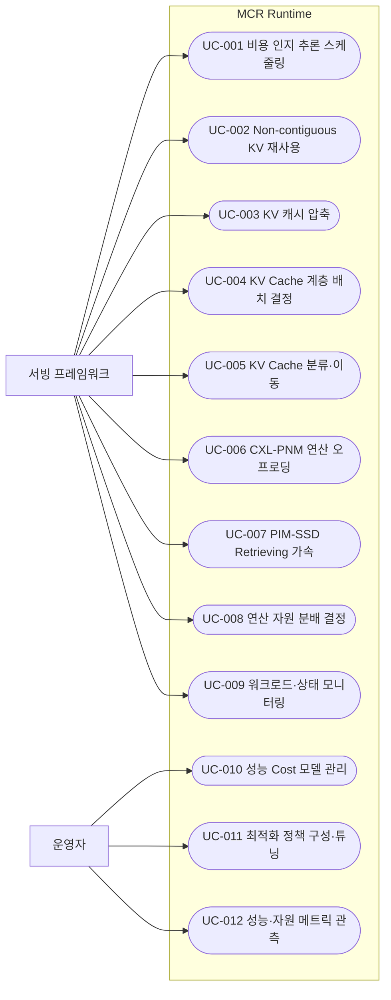
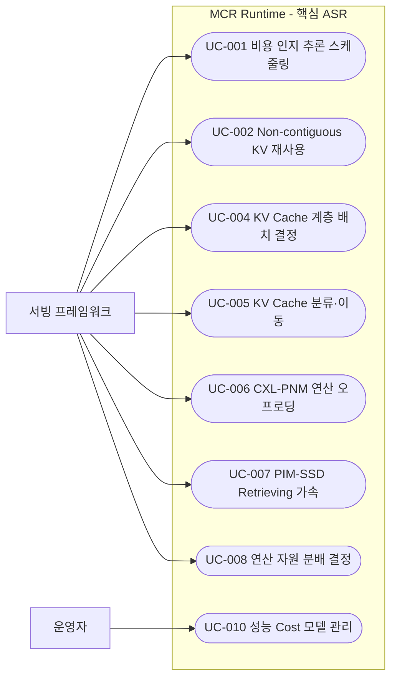

# Use Case 목록

## Use Case 개요

### 목적

`system.md`의 포함 기능과 `business.md`의 비즈니스 목표·드라이버를 분석하여, MCR Runtime이 제공해야 하는 주요 기능을 Use Case로 도출한다. 본 문서는 기능적 요구사항의 기준 목록이며, 구조 설계에 중요한 영향을 주는 ASR(Architecturally Significant Requirement) Use Case를 식별·분석한다.

### 식별 기준

- `system.md`의 포함 기능 영역(추론 오케스트레이션 / Computable-Memory 최적화 / Tiered-Memory 최적화 / 공통 기반)에 속하는 기능
- 사용자 유형(LLM 서빙 프레임워크 = 시스템 액터, 연구/플랫폼 엔지니어 = 운영자)에게 가치를 제공하는 기능
- 비즈니스 목표(추론 비용 절감, 디바이스 가속 가치 실증)에 기여하는 기능
- 시스템 범위에서 제외된 기능(서빙 엔진 본체, 모델 학습, HW 설계, 실험 인프라 구축)은 Use Case로 식별하지 않음

### 액터

- **서빙 프레임워크 (시스템 액터)**: vLLM/SGLang 등 상위 LLM 서빙 스택. 추론 요청·KV 캐시 핸들을 전달하고 스케줄링/배치/오프로딩 결정을 MCR Runtime에 위임한다.
- **운영자 (연구/플랫폼 엔지니어)**: 정책·Cost 모델을 구성·튜닝하고 성능 결과를 관측·분석한다.

## Use Case 목록

### UC-001-비용-인지-메모리-중심-추론-스케줄링
- **설명**: 워크로드 특성(요청 패턴·토큰 길이·반복성)과 시스템 상태(메모리 계층·용량·비용)를 인지하여, 성능 Cost 모델 기반으로 KV 캐시와 Load의 배치 정책을 동적으로 결정한다. (추론 오케스트레이션의 중심 기능)
- **주요 액터**: 서빙 프레임워크

### UC-002-Non-contiguous-KV-캐시-재사용
- **설명**: 토큰 위치가 정확히 일치하지 않아도 재사용 가능한 KV 캐시 영역을 식별하여 재사용함으로써 재연산을 줄인다.
- **주요 액터**: 서빙 프레임워크

### UC-003-KV-캐시-압축
- **설명**: KV 캐시를 압축하여 메모리 풋프린트를 줄이고, 압축/복원 비용과 메모리 절감 간 트레이드오프를 관리한다.
- **주요 액터**: 서빙 프레임워크

### UC-004-KV-Cache-계층-배치-결정
- **설명**: Tiered Memory(PIM/PNM·DRAM·CXL·SSD) 내에서 KV Cache의 최적 Data Placement를 결정하여 TTFT(Time To First Token)를 최적화한다.
- **주요 액터**: 서빙 프레임워크

### UC-005-KV-Cache-분류-및-계층-간-이동
- **설명**: 데이터 성격에 따라 KV Cache를 분류(Classification)하고, 분류 정책에 따라 메모리 계층 간 이동(Migration)을 수행한다.
- **주요 액터**: 서빙 프레임워크

### UC-006-CXL-PNM-연산-오프로딩
- **설명**: Attention 등 LLM 연산을 CXL-PNM 디바이스로 오프로딩하여 GPU 연산 부하와 데이터 이동 비용을 줄인다.
- **주요 액터**: 서빙 프레임워크

### UC-007-PIM-SSD-Retrieving-가속-오프로딩
- **설명**: 대용량 데이터 검색(Retrieving) 연산을 PIM-SSD로 In-Storage 오프로딩하여 검색 지연과 데이터 이동 비용을 최소화한다.
- **주요 액터**: 서빙 프레임워크

### UC-008-연산-자원-분배-결정
- **설명**: 성능 Cost 모델을 기반으로 GPU·CXL-PNM·PIM-SSD 간 연산을 분배하고, 가속 전략(Pipelining, Tiling, Data Placement)을 적용한다.
- **주요 액터**: 서빙 프레임워크

### UC-009-워크로드-특성-인지-및-시스템-상태-모니터링
- **설명**: 요청 패턴·토큰 길이·반복성 등 워크로드 특성과 메모리 계층의 상태·용량·비용 텔레메트리를 수집하여 의사결정의 입력으로 제공한다.
- **주요 액터**: 서빙 프레임워크 (텔레메트리 원천: 이기종 메모리 계층)

### UC-010-성능-Cost-모델-관리
- **설명**: 메모리 계층/HW 자원을 추상화한 성능 Cost 모델을 정의·갱신·교정하여, 스케줄링·배치·오프로딩 결정이 참조하도록 한다.
- **주요 액터**: 운영자

### UC-011-최적화-정책-구성-및-튜닝
- **설명**: 스케줄링 정책, KV Cache 분류/이동 정책, 오프로딩 정책 등을 구성·튜닝한다.
- **주요 액터**: 운영자

### UC-012-성능-자원-메트릭-관측-및-분석
- **설명**: 처리량·TTFT·오프로딩 비율·재사용률 등 성능/자원 메트릭을 모니터링·실험 환경(TestBed/Emulation)으로 내보내고 분석한다.
- **주요 액터**: 운영자

### 전체 Use Case 다이어그램

## 핵심 ASR Use Case 목록

### 핵심 ASR Use Case 식별 기준

MCR Runtime은 본질적으로 **성능·자원 효율 최적화 런타임**이므로, 추론 성능(처리량·지연·TTFT)·자원/비용 효율·확장성(메모리 계층/디바이스 확장)·변경 용이성(정책/Cost 모델 교체)에 직접 영향을 주는 Use Case를 ASR로 평가한다. ASR 중요도가 "매우 높음" 또는 "높음"인 Use Case를 핵심 ASR로 선정한다.

### ASR 중요도 요약

| Use Case | ASR 중요도 | 핵심 ASR |
|----------|-----------|:--------:|
| UC-001 비용 인지 추론 스케줄링 | 매우 높음 | ✅ |
| UC-004 KV Cache 계층 배치 결정 | 매우 높음 | ✅ |
| UC-010 성능 Cost 모델 관리 | 매우 높음 | ✅ |
| UC-006 CXL-PNM 연산 오프로딩 | 높음 | ✅ |
| UC-007 PIM-SSD Retrieving 가속 | 높음 | ✅ |
| UC-005 KV Cache 분류·이동 | 높음 | ✅ |
| UC-002 Non-contiguous KV 재사용 | 높음 | ✅ |
| UC-008 연산 자원 분배 결정 | 높음 | ✅ |
| UC-003 KV 캐시 압축 | 중간-높음 | |
| UC-009 워크로드·상태 모니터링 | 중간-높음 | |
| UC-011 최적화 정책 구성·튜닝 | 중간 | |
| UC-012 성능·자원 메트릭 관측 | 중간 | |

### 핵심 ASR Use Case 분석

#### UC-001-비용-인지-메모리-중심-추론-스케줄링
- **ASR 중요도**: 매우 높음
- **영향을 미치는 품질 속성**:
  - **성능(처리량/지연)**: 전체 추론 처리량과 지연을 좌우하는 중심 결정 지점
  - **자원/비용 효율**: GPU 연산·데이터 이동 비용 최소화의 핵심
  - **변경 용이성**: 정책 교체·Cost 모델 변경에 유연해야 함
- **아키텍처 영향**:
  - 정책 기반(Policy-based) 스케줄러를 교체 가능한 전략(Strategy) 구조로 분리
  - 워크로드 인지·시스템 상태 모니터링(UC-009)과 Cost 모델(UC-010)에 의존하는 결정 파이프라인 필요
  - 온라인 결정 오버헤드를 경량화하는 설계 결정 요구
- **관련 Use Case**: UC-004, UC-008, UC-009, UC-010

#### UC-004-KV-Cache-계층-배치-결정
- **ASR 중요도**: 매우 높음
- **영향을 미치는 품질 속성**:
  - **성능(TTFT)**: Tiered Memory 배치가 TTFT를 직접 결정 (핵심 KPI)
  - **자원/비용 효율**: 계층별 용량·비용 특성에 맞춘 배치로 효율 확보
  - **확장성**: 새로운 메모리 계층 추가에 대응
- **아키텍처 영향**:
  - 이기종 메모리 계층을 단일 추상 모델로 다루는 계층 추상화(Tier Abstraction) 필요
  - 배치 결정과 데이터 이동(UC-005)의 결합/분리 설계 결정
  - TTFT 측정·피드백 루프 구조 요구
- **관련 Use Case**: UC-005, UC-001, UC-009

#### UC-010-성능-Cost-모델-관리
- **ASR 중요도**: 매우 높음
- **영향을 미치는 품질 속성**:
  - **성능/정확성**: Cost 모델의 정확도가 모든 스케줄링·배치·오프로딩 결정의 품질을 결정
  - **변경 용이성**: 디바이스/환경(TestBed↔Emulation) 변화에 따라 모델을 교체·교정
  - **확장성**: 신규 디바이스(차세대 CXL-PNM/PIM-SSD)의 Cost 특성 추가
- **아키텍처 영향**:
  - HW/메모리 자원을 추상화한 Cost 모델 컴포넌트를 결정 로직과 분리
  - 실측(TestBed)·에뮬레이션(QEMU) 양 환경의 모델 일관성을 위한 교정/주입 인터페이스
- **관련 Use Case**: UC-001, UC-004, UC-008

#### UC-006-CXL-PNM-연산-오프로딩
- **ASR 중요도**: 높음
- **영향을 미치는 품질 속성**:
  - **성능**: GPU 연산 부하 절감 및 데이터 이동 비용 감소
  - **자원/비용 효율**: Computable-Memory 활용으로 단위 비용 절감 (디바이스 가치 실증)
  - **이식성/확장성**: 디바이스 사양·드라이버 종속성을 격리
- **아키텍처 영향**:
  - 디바이스 오프로딩을 추상화하는 가속기 추상화 계층(Accelerator Abstraction)
  - GPU↔CXL-PNM 간 데이터 흐름·동기화 설계 결정
- **관련 Use Case**: UC-008, UC-001

#### UC-007-PIM-SSD-Retrieving-가속-오프로딩
- **ASR 중요도**: 높음
- **영향을 미치는 품질 속성**:
  - **성능**: 대용량 검색 지연 단축 (긴 컨텍스트/RAG 워크로드 대응)
  - **자원/비용 효율**: In-Storage 처리로 데이터 이동 비용 최소화
  - **확장성**: 대용량 데이터셋 검색 처리량 확장
- **아키텍처 영향**:
  - 검색 연산 오프로딩을 위한 PIM-SSD 인터페이스 추상화 (UC-006과 공통 가속기 추상화로 통합 가능)
  - 검색 결과와 추론 파이프라인의 연계 흐름 설계
- **관련 Use Case**: UC-008, UC-006

#### UC-005-KV-Cache-분류-및-계층-간-이동
- **ASR 중요도**: 높음
- **영향을 미치는 품질 속성**:
  - **성능(TTFT)**: 분류·이동 품질이 TTFT 및 적중률에 영향
  - **자원/비용 효율**: hot/cold 데이터의 적절한 계층 배치로 효율 확보
  - **변경 용이성**: 분류 정책 교체 용이성
- **아키텍처 영향**:
  - 분류 정책을 플러그형(Pluggable Policy)으로 분리
  - 비동기 마이그레이션이 추론 경로(TTFT)를 방해하지 않도록 하는 설계
- **관련 Use Case**: UC-004, UC-011

#### UC-002-Non-contiguous-KV-캐시-재사용
- **ASR 중요도**: 높음
- **영향을 미치는 품질 속성**:
  - **성능(처리량)**: 재연산 감소로 처리량 향상
  - **자원/비용 효율**: 메모리 풋프린트 및 GPU 연산 절감
  - **정확성/신뢰성**: 위치 불일치 재사용의 결과 정확성 보장 필요
- **아키텍처 영향**:
  - 비연속 KV 영역 인덱싱·매칭 자료구조 설계
  - 재사용 정확성 검증 메커니즘
- **관련 Use Case**: UC-001, UC-003

#### UC-008-연산-자원-분배-결정
- **ASR 중요도**: 높음
- **영향을 미치는 품질 속성**:
  - **성능**: GPU/CXL-PNM/PIM-SSD 분배가 처리량·지연에 직접 영향
  - **자원/비용 효율**: 가속 전략(Pipelining/Tiling) 적용으로 효율 극대화
  - **확장성**: 가속기 종류 추가에 대응
- **아키텍처 영향**:
  - 연산 분배 결정을 Cost 모델(UC-010)·가속기 추상화(UC-006/007)와 연결하는 디스패처 구조
  - 가속 전략을 정책으로 구성 가능하게 하는 설계
- **관련 Use Case**: UC-001, UC-006, UC-007, UC-010

### 핵심 ASR Use Case 다이어그램

---

> **참고**: 본 문서는 Phase 2 usecase-extractor가 `system.md`·`business.md`를 기반으로 작성한 Use Case 목록 및 ASR 분석서이다. 각 Use Case의 상세 명세(액터·사전조건·사후조건·주요 시나리오)는 `usecase-specifier`(`/agentk/specify-usecase`)가 `usecase/UC-nnn.md`로 작성한다. 핵심 ASR Use Case는 Phase 4(품질 요구사항 선정) 및 Phase 5(후보 구조 설계)에서 우선 고려된다.
